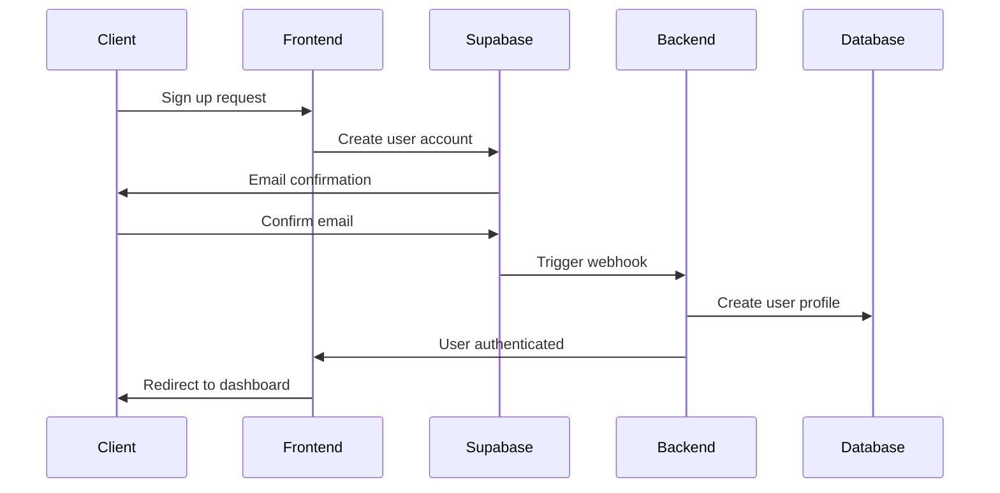

# Authentication API Endpoints

## Overview

This document details all authentication-related API endpoints for the Resume-Matcher SaaS platform. All authentication is handled through Supabase Auth with custom business logic for subscription management and user onboarding.

## Base URL
```
https://api.resume-matcher.com/v1/auth
```

## Authentication Flow



## Endpoints

### POST /auth/signup

Register a new user account with email verification.

**Request Body:**
```json
{
  "email": "user@example.com",
  "password": "securePassword123",
  "full_name": "John Doe",
  "company": "TechCorp Inc.",
  "job_title": "Software Engineer",
  "metadata": {
    "source": "landing_page",
    "utm_campaign": "google_ads",
    "referrer": "https://google.com"
  }
}
```

**Validation Rules:**
- `email`: Valid email format, not already registered
- `password`: Minimum 8 characters, uppercase, lowercase, number, special character
- `full_name`: 2-100 characters, required
- `company`: Optional, max 100 characters
- `job_title`: Optional, max 100 characters
- `metadata`: Optional tracking data

**Success Response (201 Created):**
```json
{
  "success": true,
  "message": "Account created successfully. Please check your email for verification.",
  "user": {
    "id": "uuid",
    "email": "user@example.com",
    "email_confirmed": false,
    "created_at": "2024-01-15T10:30:00Z"
  },
  "next_step": "email_verification"
}
```

**Error Responses:**

```json
// 400 Bad Request - Invalid input
{
  "error": {
    "code": "VALIDATION_ERROR",
    "message": "Invalid input data",
    "details": {
      "email": "Invalid email format",
      "password": "Password must contain at least 8 characters"
    }
  }
}

// 409 Conflict - Email already exists
{
  "error": {
    "code": "EMAIL_EXISTS",
    "message": "An account with this email already exists",
    "details": {
      "suggestion": "Try signing in instead or use password reset"
    }
  }
}
```

### POST /auth/signin

Authenticate an existing user with email and password.

**Request Body:**
```json
{
  "email": "user@example.com",
  "password": "securePassword123",
  "remember_me": true
}
```

**Success Response (200 OK):**
```json
{
  "success": true,
  "user": {
    "id": "uuid",
    "email": "user@example.com",
    "full_name": "John Doe",
    "email_confirmed": true,
    "onboarding_completed": true,
    "subscription": {
      "plan": "pro",
      "status": "active",
      "current_period_end": "2024-02-15T10:30:00Z"
    }
  },
  "session": {
    "access_token": "jwt_token_here",
    "refresh_token": "refresh_token_here",
    "expires_in": 3600,
    "token_type": "Bearer"
  },
  "redirect_url": "/dashboard"
}
```

**Error Responses:**

```json
// 401 Unauthorized - Invalid credentials
{
  "error": {
    "code": "INVALID_CREDENTIALS",
    "message": "Invalid email or password",
    "details": {
      "attempts_remaining": 3,
      "lockout_time": null
    }
  }
}

// 423 Locked - Account locked
{
  "error": {
    "code": "ACCOUNT_LOCKED",
    "message": "Account temporarily locked due to multiple failed attempts",
    "details": {
      "lockout_expires": "2024-01-15T11:30:00Z",
      "lockout_duration_minutes": 15
    }
  }
}

// 403 Forbidden - Email not verified
{
  "error": {
    "code": "EMAIL_NOT_VERIFIED",
    "message": "Please verify your email address before signing in",
    "details": {
      "resend_verification_url": "/auth/resend-verification"
    }
  }
}
```

### POST /auth/signin/social

Authenticate using social OAuth providers (Google, LinkedIn, GitHub).

**Request Body:**
```json
{
  "provider": "google",
  "redirect_url": "https://app.resume-matcher.com/auth/callback",
  "scopes": ["email", "profile"]
}
```

**Success Response (200 OK):**
```json
{
  "success": true,
  "auth_url": "https://accounts.google.com/oauth/authorize?client_id=...",
  "state": "random_state_string",
  "expires_in": 600
}
```

### POST /auth/signout

Sign out the current user and invalidate session tokens.

**Headers:**
```
Authorization: Bearer <access_token>
```

**Request Body:**
```json
{
  "everywhere": false
}
```

**Success Response (200 OK):**
```json
{
  "success": true,
  "message": "Successfully signed out"
}
```

### POST /auth/refresh

Refresh the user's access token using a refresh token.

**Request Body:**
```json
{
  "refresh_token": "refresh_token_here"
}
```

**Success Response (200 OK):**
```json
{
  "success": true,
  "session": {
    "access_token": "new_jwt_token",
    "refresh_token": "new_refresh_token",
    "expires_in": 3600,
    "token_type": "Bearer"
  }
}
```

**Error Response:**
```json
// 401 Unauthorized - Invalid refresh token
{
  "error": {
    "code": "INVALID_REFRESH_TOKEN",
    "message": "Refresh token is invalid or expired",
    "details": {
      "action_required": "Please sign in again"
    }
  }
}
```

### POST /auth/forgot-password

Initiate password reset process by sending reset email.

**Request Body:**
```json
{
  "email": "user@example.com",
  "redirect_url": "https://app.resume-matcher.com/auth/reset-password"
}
```

**Success Response (200 OK):**
```json
{
  "success": true,
  "message": "If an account with that email exists, we've sent password reset instructions.",
  "details": {
    "rate_limit": {
      "requests_remaining": 2,
      "reset_time": "2024-01-15T11:30:00Z"
    }
  }
}
```

### POST /auth/reset-password

Reset password using the token from email.

**Request Body:**
```json
{
  "token": "reset_token_from_email",
  "password": "newSecurePassword123",
  "confirm_password": "newSecurePassword123"
}
```

**Success Response (200 OK):**
```json
{
  "success": true,
  "message": "Password reset successfully",
  "redirect_url": "/auth/signin"
}
```

**Error Responses:**

```json
// 400 Bad Request - Invalid token
{
  "error": {
    "code": "INVALID_RESET_TOKEN",
    "message": "Password reset token is invalid or expired",
    "details": {
      "action_required": "Request a new password reset"
    }
  }
}

// 400 Bad Request - Password mismatch
{
  "error": {
    "code": "PASSWORD_MISMATCH",
    "message": "Passwords do not match"
  }
}
```

### POST /auth/change-password

Change password for authenticated user.

**Headers:**
```
Authorization: Bearer <access_token>
```

**Request Body:**
```json
{
  "current_password": "currentPassword123",
  "new_password": "newSecurePassword123",
  "confirm_password": "newSecurePassword123"
}
```

**Success Response (200 OK):**
```json
{
  "success": true,
  "message": "Password changed successfully"
}
```

### GET /auth/verify-email

Verify email address using token from verification email.

**Query Parameters:**
- `token`: Email verification token
- `redirect_url`: Optional redirect after verification

**Success Response (200 OK):**
```json
{
  "success": true,
  "message": "Email verified successfully",
  "user": {
    "id": "uuid",
    "email": "user@example.com",
    "email_confirmed": true
  },
  "redirect_url": "/dashboard"
}
```

### POST /auth/resend-verification

Resend email verification for unverified accounts.

**Request Body:**
```json
{
  "email": "user@example.com"
}
```

**Success Response (200 OK):**
```json
{
  "success": true,
  "message": "Verification email sent successfully",
  "details": {
    "rate_limit": {
      "requests_remaining": 2,
      "reset_time": "2024-01-15T11:30:00Z"
    }
  }
}
```

### GET /auth/session

Get current user session information.

**Headers:**
```
Authorization: Bearer <access_token>
```

**Success Response (200 OK):**
```json
{
  "success": true,
  "user": {
    "id": "uuid",
    "email": "user@example.com",
    "full_name": "John Doe",
    "avatar_url": "https://...",
    "email_confirmed": true,
    "created_at": "2024-01-15T10:30:00Z",
    "last_signin": "2024-01-15T10:30:00Z"
  },
  "session": {
    "expires_at": "2024-01-15T14:30:00Z",
    "created_at": "2024-01-15T10:30:00Z"
  },
  "subscription": {
    "plan": "pro",
    "status": "active",
    "features": {
      "advanced_analytics": true,
      "api_access": true,
      "priority_support": true
    },
    "usage": {
      "analyses_this_month": 15,
      "uploads_this_month": 3,
      "analyses_limit": 100,
      "uploads_limit": 25
    }
  }
}
```

## Multi-Factor Authentication (MFA)

### POST /auth/mfa/enroll

Enroll in TOTP-based multi-factor authentication.

**Headers:**
```
Authorization: Bearer <access_token>
```

**Request Body:**
```json
{
  "factor_type": "totp",
  "friendly_name": "My Phone"
}
```

**Success Response (200 OK):**
```json
{
  "success": true,
  "factor": {
    "id": "factor_uuid",
    "factor_type": "totp",
    "friendly_name": "My Phone",
    "status": "unverified"
  },
  "totp": {
    "qr_code": "data:image/svg+xml;base64,...",
    "secret": "JBSWY3DPEHPK3PXP",
    "uri": "otpauth://totp/Resume-Matcher:user@example.com?secret=JBSWY3DPEHPK3PXP&issuer=Resume-Matcher"
  }
}
```

### POST /auth/mfa/verify

Verify TOTP code and complete MFA enrollment.

**Headers:**
```
Authorization: Bearer <access_token>
```

**Request Body:**
```json
{
  "factor_id": "factor_uuid",
  "code": "123456"
}
```

**Success Response (200 OK):**
```json
{
  "success": true,
  "factor": {
    "id": "factor_uuid",
    "factor_type": "totp",
    "friendly_name": "My Phone",
    "status": "verified"
  },
  "backup_codes": [
    "abc123def456",
    "ghi789jkl012",
    "mno345pqr678",
    "stu901vwx234",
    "yza567bcd890"
  ]
}
```

### POST /auth/mfa/challenge

Initiate MFA challenge during sign-in.

**Request Body:**
```json
{
  "factor_id": "factor_uuid"
}
```

**Success Response (200 OK):**
```json
{
  "success": true,
  "challenge": {
    "id": "challenge_uuid",
    "factor_id": "factor_uuid",
    "expires_at": "2024-01-15T10:35:00Z"
  }
}
```

### POST /auth/mfa/verify-challenge

Verify MFA challenge with TOTP code.

**Request Body:**
```json
{
  "challenge_id": "challenge_uuid",
  "code": "123456"
}
```

**Success Response (200 OK):**
```json
{
  "success": true,
  "session": {
    "access_token": "jwt_token_here",
    "refresh_token": "refresh_token_here",
    "expires_in": 3600,
    "token_type": "Bearer"
  }
}
```

## Rate Limiting

All authentication endpoints are rate-limited to prevent abuse:

| Endpoint | Limit | Window |
|----------|--------|---------|
| `/auth/signup` | 5 requests | 1 hour |
| `/auth/signin` | 10 requests | 15 minutes |
| `/auth/forgot-password` | 3 requests | 1 hour |
| `/auth/resend-verification` | 3 requests | 1 hour |
| `/auth/refresh` | 100 requests | 1 hour |

Rate limit headers are included in all responses:
```
X-RateLimit-Limit: 10
X-RateLimit-Remaining: 7
X-RateLimit-Reset: 1642262400
X-RateLimit-Retry-After: 300
```

## Security Considerations

### Password Security
- Minimum 8 characters with complexity requirements
- Passwords hashed using bcrypt with salt rounds ≥ 12
- Password history prevents reuse of last 12 passwords
- Account lockout after 5 failed attempts for 15 minutes

### Session Security
- JWT tokens expire after 1 hour
- Refresh tokens expire after 30 days with automatic rotation
- Secure HTTP-only cookies for refresh tokens
- CSRF protection with SameSite cookie attributes

### MFA Security
- TOTP secrets generated using cryptographically secure random
- Backup codes for account recovery (one-time use)
- Time-based codes with 30-second window and clock skew tolerance

### Audit Logging
All authentication events are logged for security monitoring:
- Successful and failed sign-ins
- Password changes and resets
- MFA enrollment and verification
- Account lockouts and unlocks

## Error Handling

### Standard Error Format
```json
{
  "error": {
    "code": "ERROR_CODE",
    "message": "Human-readable error message",
    "details": {
      "field": "Additional context"
    },
    "timestamp": "2024-01-15T10:30:00Z",
    "request_id": "req_123456"
  }
}
```

### Common Error Codes
- `VALIDATION_ERROR`: Invalid input data
- `INVALID_CREDENTIALS`: Wrong email/password
- `EMAIL_EXISTS`: Account already exists
- `EMAIL_NOT_VERIFIED`: Email verification required
- `ACCOUNT_LOCKED`: Too many failed attempts
- `RATE_LIMITED`: Too many requests
- `INVALID_TOKEN`: Invalid or expired token
- `MFA_REQUIRED`: MFA verification needed
- `INVALID_MFA_CODE`: Wrong MFA code

## Integration Examples

### Frontend Authentication Hook (React)

```typescript
import { useState, useEffect } from 'react'
import { authAPI } from './api'

export const useAuth = () => {
  const [user, setUser] = useState(null)
  const [loading, setLoading] = useState(true)

  useEffect(() => {
    checkSession()
  }, [])

  const checkSession = async () => {
    try {
      const { data } = await authAPI.getSession()
      setUser(data.user)
    } catch (error) {
      setUser(null)
    } finally {
      setLoading(false)
    }
  }

  const signIn = async (email: string, password: string) => {
    const { data } = await authAPI.signIn({ email, password })
    setUser(data.user)
    return data
  }

  const signOut = async () => {
    await authAPI.signOut()
    setUser(null)
  }

  return { user, loading, signIn, signOut }
}
```

### Backend Middleware (FastAPI)

```python
from fastapi import Depends, HTTPException, status
from fastapi.security import HTTPBearer, HTTPAuthorizationCredentials
import jwt

security = HTTPBearer()

async def get_current_user(
    credentials: HTTPAuthorizationCredentials = Depends(security)
) -> dict:
    try:
        payload = jwt.decode(
            credentials.credentials,
            settings.JWT_SECRET,
            algorithms=["HS256"]
        )
        user_id = payload.get("sub")
        if not user_id:
            raise HTTPException(
                status_code=status.HTTP_401_UNAUTHORIZED,
                detail="Invalid token"
            )
        return {"id": user_id, "email": payload.get("email")}
    except jwt.ExpiredSignatureError:
        raise HTTPException(
            status_code=status.HTTP_401_UNAUTHORIZED,
            detail="Token expired"
        )
    except jwt.InvalidTokenError:
        raise HTTPException(
            status_code=status.HTTP_401_UNAUTHORIZED,
            detail="Invalid token"
        )
```

---

**Next Steps**: Review `resumes.md` for resume management endpoints and `subscriptions.md` for billing-related authentication flows.