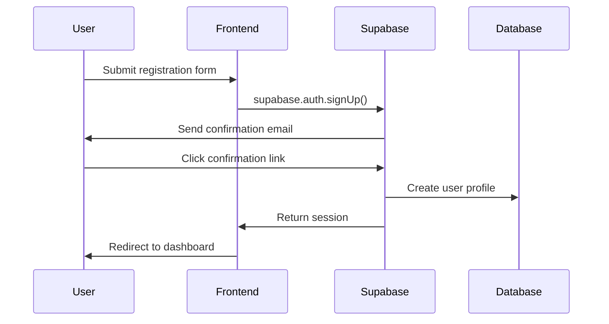
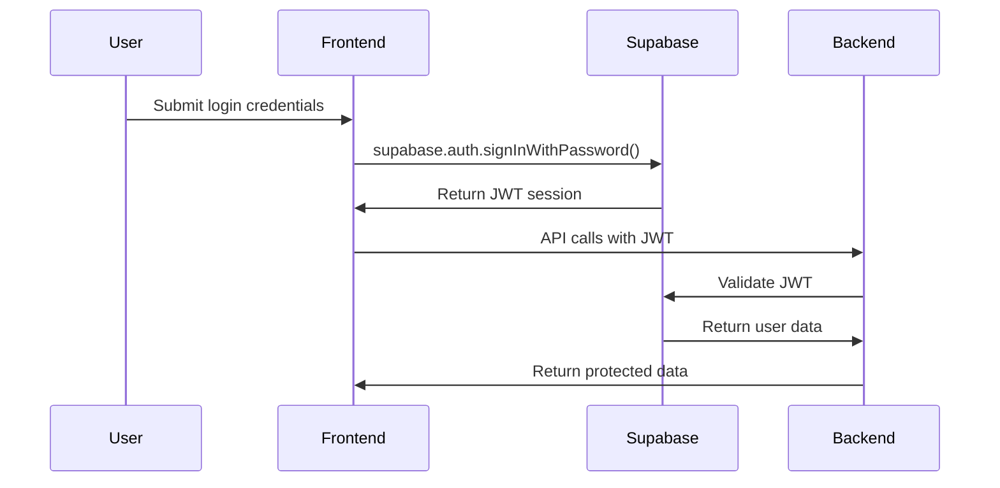
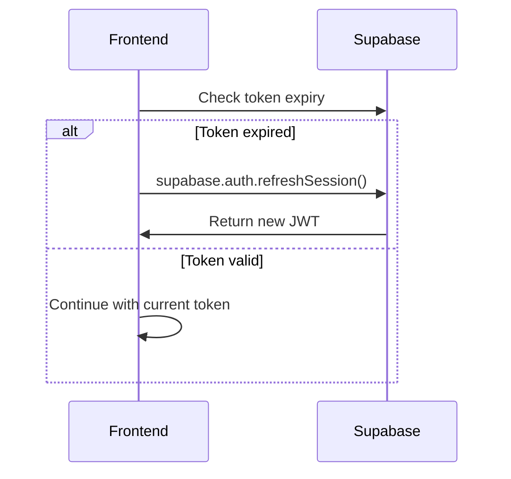

# Authentication Architecture

## Overview

The Resume-Matcher SaaS platform uses Supabase Auth as the primary authentication provider, offering secure, scalable user management with enterprise-grade security features.

## Authentication Strategy

### Core Components
- **Primary Provider**: Supabase Auth
- **Token Type**: JWT (JSON Web Tokens)
- **Session Management**: Secure HTTP-only cookies + localStorage
- **Multi-Factor Authentication**: TOTP and SMS support
- **Social Providers**: Google, GitHub, LinkedIn

## Authentication Flow

### 1. User Registration



### 2. User Login



### 3. Token Refresh



## Security Configuration

### JWT Token Settings
```typescript
// Supabase JWT configuration
{
  jwt: {
    expiry: 3600, // 1 hour
    secret: process.env.SUPABASE_JWT_SECRET,
    algorithm: 'HS256'
  },
  refreshToken: {
    expiry: 2592000, // 30 days
    rotationEnabled: true
  }
}
```

### Password Policy
```typescript
{
  minLength: 8,
  requireUppercase: true,
  requireLowercase: true,
  requireNumbers: true,
  requireSpecialChars: true,
  preventCommonPasswords: true,
  preventUserInfoInPassword: true
}
```

### Rate Limiting
```typescript
{
  login: {
    maxAttempts: 5,
    windowMs: 900000, // 15 minutes
    blockDuration: 3600000 // 1 hour
  },
  registration: {
    maxAttempts: 3,
    windowMs: 3600000 // 1 hour
  },
  passwordReset: {
    maxAttempts: 3,
    windowMs: 3600000 // 1 hour
  }
}
```

## Implementation Details

### Frontend Authentication (Next.js)

#### 1. Supabase Client Setup
```typescript
// lib/supabase.ts
import { createClientComponentClient } from '@supabase/auth-helpers-nextjs'

export const supabase = createClientComponentClient({
  supabaseUrl: process.env.NEXT_PUBLIC_SUPABASE_URL!,
  supabaseKey: process.env.NEXT_PUBLIC_SUPABASE_ANON_KEY!
})
```

#### 2. Auth Context Provider
```typescript
// contexts/AuthContext.tsx
import { createContext, useContext, useEffect, useState } from 'react'
import { User, Session } from '@supabase/supabase-js'
import { supabase } from '@/lib/supabase'

interface AuthContextType {
  user: User | null
  session: Session | null
  loading: boolean
  signIn: (email: string, password: string) => Promise<void>
  signUp: (email: string, password: string, metadata?: any) => Promise<void>
  signOut: () => Promise<void>
  resetPassword: (email: string) => Promise<void>
}

const AuthContext = createContext<AuthContextType>({} as AuthContextType)

export const AuthProvider = ({ children }: { children: React.ReactNode }) => {
  const [user, setUser] = useState<User | null>(null)
  const [session, setSession] = useState<Session | null>(null)
  const [loading, setLoading] = useState(true)

  useEffect(() => {
    // Get initial session
    supabase.auth.getSession().then(({ data: { session } }) => {
      setSession(session)
      setUser(session?.user ?? null)
      setLoading(false)
    })

    // Listen for auth changes
    const { data: { subscription } } = supabase.auth.onAuthStateChange(
      async (event, session) => {
        setSession(session)
        setUser(session?.user ?? null)
        setLoading(false)
      }
    )

    return () => subscription.unsubscribe()
  }, [])

  const signIn = async (email: string, password: string) => {
    const { error } = await supabase.auth.signInWithPassword({
      email,
      password
    })
    if (error) throw error
  }

  const signUp = async (email: string, password: string, metadata?: any) => {
    const { error } = await supabase.auth.signUp({
      email,
      password,
      options: {
        data: metadata
      }
    })
    if (error) throw error
  }

  const signOut = async () => {
    const { error } = await supabase.auth.signOut()
    if (error) throw error
  }

  const resetPassword = async (email: string) => {
    const { error } = await supabase.auth.resetPasswordForEmail(email, {
      redirectTo: `${window.location.origin}/auth/reset-password`
    })
    if (error) throw error
  }

  return (
    <AuthContext.Provider value={{
      user,
      session,
      loading,
      signIn,
      signUp,
      signOut,
      resetPassword
    }}>
      {children}
    </AuthContext.Provider>
  )
}

export const useAuth = () => {
  const context = useContext(AuthContext)
  if (context === undefined) {
    throw new Error('useAuth must be used within an AuthProvider')
  }
  return context
}
```

#### 3. Protected Route Component
```typescript
// components/ProtectedRoute.tsx
import { useAuth } from '@/contexts/AuthContext'
import { useRouter } from 'next/router'
import { useEffect } from 'react'

interface ProtectedRouteProps {
  children: React.ReactNode
  requirePlan?: string[]
  requireRole?: string[]
}

export const ProtectedRoute = ({ 
  children, 
  requirePlan = [], 
  requireRole = [] 
}: ProtectedRouteProps) => {
  const { user, session, loading } = useAuth()
  const router = useRouter()

  useEffect(() => {
    if (!loading && !session) {
      router.push('/auth/login')
      return
    }

    if (user && requirePlan.length > 0) {
      // Check subscription plan
      // Implementation depends on your subscription logic
    }

    if (user && requireRole.length > 0) {
      // Check user role
      // Implementation depends on your role system
    }
  }, [user, session, loading, router])

  if (loading) {
    return <div>Loading...</div>
  }

  if (!session) {
    return null
  }

  return <>{children}</>
}
```

### Backend Authentication (FastAPI)

#### 1. JWT Verification Middleware
```python
# auth/middleware.py
from fastapi import HTTPException, Depends
from fastapi.security import HTTPBearer, HTTPAuthorizationCredentials
from supabase import create_client, Client
import jwt
import os

security = HTTPBearer()

def get_supabase_client() -> Client:
    return create_client(
        os.getenv("SUPABASE_URL"),
        os.getenv("SUPABASE_SERVICE_KEY")
    )

async def verify_token(
    credentials: HTTPAuthorizationCredentials = Depends(security)
) -> dict:
    try:
        # Verify JWT token with Supabase
        supabase = get_supabase_client()
        
        # Decode and verify token
        payload = jwt.decode(
            credentials.credentials,
            os.getenv("SUPABASE_JWT_SECRET"),
            algorithms=["HS256"],
            audience="authenticated"
        )
        
        return payload
    except jwt.ExpiredSignatureError:
        raise HTTPException(
            status_code=401,
            detail="Token has expired"
        )
    except jwt.InvalidTokenError:
        raise HTTPException(
            status_code=401,
            detail="Invalid token"
        )

async def get_current_user(token_payload: dict = Depends(verify_token)) -> dict:
    user_id = token_payload.get("sub")
    if not user_id:
        raise HTTPException(
            status_code=401,
            detail="Invalid token payload"
        )
    
    # Get user from database
    supabase = get_supabase_client()
    result = supabase.table("profiles").select("*").eq("id", user_id).execute()
    
    if not result.data:
        raise HTTPException(
            status_code=404,
            detail="User not found"
        )
    
    return result.data[0]

async def require_subscription(
    user: dict = Depends(get_current_user),
    required_plan: str = "pro"
) -> dict:
    # Check user subscription status
    supabase = get_supabase_client()
    subscription = supabase.table("subscriptions")\
        .select("*, subscription_plans(*)")\
        .eq("user_id", user["id"])\
        .eq("status", "active")\
        .execute()
    
    if not subscription.data:
        raise HTTPException(
            status_code=403,
            detail="Active subscription required"
        )
    
    user_plan = subscription.data[0]["subscription_plans"]["slug"]
    
    # Define plan hierarchy
    plan_levels = {"free": 0, "pro": 1, "enterprise": 2}
    
    if plan_levels.get(user_plan, 0) < plan_levels.get(required_plan, 1):
        raise HTTPException(
            status_code=403,
            detail=f"{required_plan.title()} subscription required"
        )
    
    return user
```

#### 2. Usage in FastAPI Routes
```python
# routes/resumes.py
from fastapi import APIRouter, Depends
from auth.middleware import get_current_user, require_subscription

router = APIRouter()

@router.get("/resumes")
async def get_resumes(user: dict = Depends(get_current_user)):
    # Get user's resumes
    pass

@router.post("/analysis/advanced")
async def advanced_analysis(user: dict = Depends(require_subscription)):
    # Advanced analysis requires subscription
    pass
```

## Social Authentication

### Google OAuth Setup
```typescript
// Configure Google OAuth
const signInWithGoogle = async () => {
  const { error } = await supabase.auth.signInWithOAuth({
    provider: 'google',
    options: {
      scopes: 'openid email profile',
      redirectTo: `${window.location.origin}/auth/callback`
    }
  })
  if (error) throw error
}
```

### LinkedIn OAuth Setup
```typescript
const signInWithLinkedIn = async () => {
  const { error } = await supabase.auth.signInWithOAuth({
    provider: 'linkedin',
    options: {
      scopes: 'r_liteprofile r_emailaddress',
      redirectTo: `${window.location.origin}/auth/callback`
    }
  })
  if (error) throw error
}
```

## Multi-Factor Authentication

### TOTP Setup
```typescript
// Enable TOTP for user
const enableTOTP = async () => {
  const { data, error } = await supabase.auth.mfa.enroll({
    factorType: 'totp'
  })
  
  if (error) throw error
  
  // Show QR code to user
  return data.qr_code
}

// Verify TOTP challenge
const verifyTOTP = async (code: string, challengeId: string) => {
  const { error } = await supabase.auth.mfa.verify({
    factorId: challengeId,
    challengeId,
    code
  })
  
  if (error) throw error
}
```

## Session Management

### Automatic Token Refresh
```typescript
// Auto-refresh tokens
useEffect(() => {
  const interval = setInterval(async () => {
    const { data: { session } } = await supabase.auth.getSession()
    
    if (session?.expires_at) {
      const expiresAt = new Date(session.expires_at * 1000)
      const now = new Date()
      const timeUntilExpiry = expiresAt.getTime() - now.getTime()
      
      // Refresh if token expires in less than 5 minutes
      if (timeUntilExpiry < 5 * 60 * 1000) {
        await supabase.auth.refreshSession()
      }
    }
  }, 60000) // Check every minute
  
  return () => clearInterval(interval)
}, [])
```

### Logout All Sessions
```typescript
const logoutAllSessions = async () => {
  // Sign out from current session
  await supabase.auth.signOut({ scope: 'global' })
  
  // Clear all stored data
  localStorage.clear()
  sessionStorage.clear()
  
  // Redirect to login
  router.push('/auth/login')
}
```

## Security Best Practices

### 1. Token Storage
- **Access Tokens**: Memory only (not localStorage)
- **Refresh Tokens**: Secure HTTP-only cookies
- **CSRF Protection**: SameSite cookie attributes

### 2. Password Security
- **Hashing**: bcrypt with salt rounds ≥ 12
- **Validation**: Strength requirements enforced
- **History**: Prevent password reuse (last 12)

### 3. Session Security
- **Timeout**: Automatic logout after inactivity
- **Concurrent Sessions**: Limit active sessions per user
- **Device Tracking**: Log login locations and devices

### 4. API Security
- **Rate Limiting**: Per-user and per-IP limits
- **CORS**: Restricted to allowed origins
- **Headers**: Security headers on all responses

## Monitoring & Alerts

### Authentication Metrics
- Login success/failure rates
- Password reset frequency
- MFA adoption rates
- Suspicious login patterns

### Security Alerts
- Multiple failed login attempts
- Login from new locations
- Unusual API usage patterns
- Token manipulation attempts

## Compliance

### GDPR Compliance
- **Data Minimization**: Collect only necessary data
- **Right to Deletion**: User account deletion
- **Data Portability**: Export user data
- **Consent Management**: Clear opt-in/opt-out

### SOC 2 Compliance
- **Access Controls**: Role-based permissions
- **Audit Logging**: All auth events logged
- **Encryption**: Data at rest and in transit
- **Incident Response**: Security incident procedures

---

**Next Steps**: Review `security/authentication.md` for additional security measures and `frontend/components/auth-components.md` for UI implementation details.