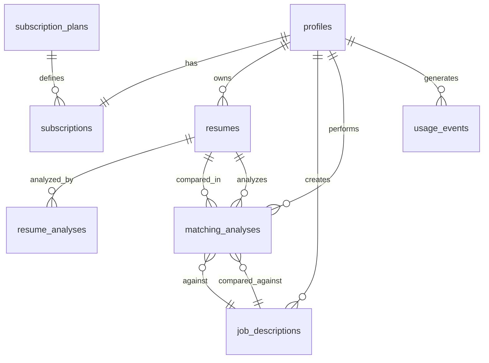

# Database Design

## Overview

This document outlines the complete database schema design for the Resume-Matcher SaaS platform, built on PostgreSQL with Supabase as the backend provider.

## Core Design Principles

- **Multi-tenancy**: Each user has isolated data with Row Level Security (RLS)
- **Scalability**: Optimized for horizontal scaling and high-volume operations
- **Security**: End-to-end encryption for sensitive data
- **Audit Trail**: Complete tracking of user actions and data changes
- **Performance**: Indexed for common query patterns

## Schema Overview

### 1. Authentication & User Management

```sql
-- Extends Supabase auth.users table
CREATE TABLE public.profiles (
  id UUID REFERENCES auth.users(id) PRIMARY KEY,
  email TEXT NOT NULL UNIQUE,
  full_name TEXT,
  avatar_url TEXT,
  company TEXT,
  job_title TEXT,
  onboarding_completed BOOLEAN DEFAULT FALSE,
  preferences JSONB DEFAULT '{}',
  created_at TIMESTAMPTZ DEFAULT NOW(),
  updated_at TIMESTAMPTZ DEFAULT NOW()
);
```

### 2. Subscription Management

```sql
-- Subscription plans
CREATE TABLE subscription_plans (
  id UUID PRIMARY KEY DEFAULT gen_random_uuid(),
  name TEXT NOT NULL UNIQUE,
  slug TEXT NOT NULL UNIQUE,
  description TEXT,
  price_monthly INTEGER, -- cents
  price_yearly INTEGER,  -- cents
  features JSONB NOT NULL DEFAULT '{}',
  limits JSONB NOT NULL DEFAULT '{}',
  is_active BOOLEAN DEFAULT TRUE,
  sort_order INTEGER DEFAULT 0,
  created_at TIMESTAMPTZ DEFAULT NOW()
);

-- User subscriptions
CREATE TABLE subscriptions (
  id UUID PRIMARY KEY DEFAULT gen_random_uuid(),
  user_id UUID REFERENCES profiles(id) ON DELETE CASCADE,
  plan_id UUID REFERENCES subscription_plans(id),
  stripe_subscription_id TEXT UNIQUE,
  stripe_customer_id TEXT,
  status TEXT NOT NULL CHECK (status IN ('active', 'canceled', 'past_due', 'unpaid')),
  current_period_start TIMESTAMPTZ,
  current_period_end TIMESTAMPTZ,
  trial_end TIMESTAMPTZ,
  created_at TIMESTAMPTZ DEFAULT NOW(),
  updated_at TIMESTAMPTZ DEFAULT NOW()
);
```

### 3. Resume Management

```sql
-- Resume documents
CREATE TABLE resumes (
  id UUID PRIMARY KEY DEFAULT gen_random_uuid(),
  user_id UUID REFERENCES profiles(id) ON DELETE CASCADE,
  title TEXT NOT NULL,
  filename TEXT NOT NULL,
  file_path TEXT NOT NULL,
  file_size INTEGER,
  mime_type TEXT,
  content_text TEXT, -- Extracted text content
  parsed_data JSONB, -- Structured resume data
  is_active BOOLEAN DEFAULT TRUE,
  created_at TIMESTAMPTZ DEFAULT NOW(),
  updated_at TIMESTAMPTZ DEFAULT NOW()
);

-- Resume parsing results
CREATE TABLE resume_analyses (
  id UUID PRIMARY KEY DEFAULT gen_random_uuid(),
  resume_id UUID REFERENCES resumes(id) ON DELETE CASCADE,
  analysis_type TEXT NOT NULL,
  results JSONB NOT NULL,
  confidence_score DECIMAL(3,2),
  created_at TIMESTAMPTZ DEFAULT NOW()
);
```

### 4. Job Management

```sql
-- Job descriptions
CREATE TABLE job_descriptions (
  id UUID PRIMARY KEY DEFAULT gen_random_uuid(),
  user_id UUID REFERENCES profiles(id) ON DELETE CASCADE,
  title TEXT NOT NULL,
  company TEXT,
  description TEXT NOT NULL,
  requirements TEXT,
  parsed_data JSONB, -- Structured job data
  is_active BOOLEAN DEFAULT TRUE,
  created_at TIMESTAMPTZ DEFAULT NOW(),
  updated_at TIMESTAMPTZ DEFAULT NOW()
);
```

### 5. Analysis & Matching

```sql
-- Resume-job matching analyses
CREATE TABLE matching_analyses (
  id UUID PRIMARY KEY DEFAULT gen_random_uuid(),
  user_id UUID REFERENCES profiles(id) ON DELETE CASCADE,
  resume_id UUID REFERENCES resumes(id) ON DELETE CASCADE,
  job_id UUID REFERENCES job_descriptions(id) ON DELETE CASCADE,
  overall_score DECIMAL(5,2) NOT NULL,
  skills_match JSONB,
  experience_match JSONB,
  education_match JSONB,
  keyword_analysis JSONB,
  recommendations JSONB,
  created_at TIMESTAMPTZ DEFAULT NOW()
);
```

### 6. Usage Tracking

```sql
-- API usage tracking
CREATE TABLE usage_events (
  id UUID PRIMARY KEY DEFAULT gen_random_uuid(),
  user_id UUID REFERENCES profiles(id) ON DELETE CASCADE,
  event_type TEXT NOT NULL,
  resource_type TEXT NOT NULL,
  resource_id UUID,
  metadata JSONB DEFAULT '{}',
  created_at TIMESTAMPTZ DEFAULT NOW()
);

-- Monthly usage aggregates
CREATE TABLE usage_summaries (
  id UUID PRIMARY KEY DEFAULT gen_random_uuid(),
  user_id UUID REFERENCES profiles(id) ON DELETE CASCADE,
  month DATE NOT NULL,
  analyses_count INTEGER DEFAULT 0,
  resumes_uploaded INTEGER DEFAULT 0,
  jobs_analyzed INTEGER DEFAULT 0,
  api_calls INTEGER DEFAULT 0,
  storage_used BIGINT DEFAULT 0, -- bytes
  created_at TIMESTAMPTZ DEFAULT NOW(),
  UNIQUE(user_id, month)
);
```

### 7. System Tables

```sql
-- Application settings
CREATE TABLE app_settings (
  key TEXT PRIMARY KEY,
  value JSONB NOT NULL,
  description TEXT,
  updated_at TIMESTAMPTZ DEFAULT NOW()
);

-- Audit log
CREATE TABLE audit_logs (
  id UUID PRIMARY KEY DEFAULT gen_random_uuid(),
  user_id UUID REFERENCES profiles(id),
  action TEXT NOT NULL,
  table_name TEXT NOT NULL,
  record_id UUID,
  old_values JSONB,
  new_values JSONB,
  ip_address INET,
  user_agent TEXT,
  created_at TIMESTAMPTZ DEFAULT NOW()
);
```

## Indexes

```sql
-- Performance indexes
CREATE INDEX idx_resumes_user_id ON resumes(user_id);
CREATE INDEX idx_resumes_created_at ON resumes(created_at DESC);
CREATE INDEX idx_job_descriptions_user_id ON job_descriptions(user_id);
CREATE INDEX idx_matching_analyses_user_id ON matching_analyses(user_id);
CREATE INDEX idx_matching_analyses_created_at ON matching_analyses(created_at DESC);
CREATE INDEX idx_usage_events_user_id_created_at ON usage_events(user_id, created_at DESC);
CREATE INDEX idx_subscriptions_user_id ON subscriptions(user_id);
CREATE INDEX idx_subscriptions_stripe_id ON subscriptions(stripe_subscription_id);

-- Full-text search indexes
CREATE INDEX idx_resumes_content_text ON resumes USING gin(to_tsvector('english', content_text));
CREATE INDEX idx_job_descriptions_search ON job_descriptions USING gin(to_tsvector('english', title || ' ' || company || ' ' || description));
```

## Row Level Security (RLS)

```sql
-- Enable RLS on all user tables
ALTER TABLE profiles ENABLE ROW LEVEL SECURITY;
ALTER TABLE subscriptions ENABLE ROW LEVEL SECURITY;
ALTER TABLE resumes ENABLE ROW LEVEL SECURITY;
ALTER TABLE job_descriptions ENABLE ROW LEVEL SECURITY;
ALTER TABLE matching_analyses ENABLE ROW LEVEL SECURITY;
ALTER TABLE usage_events ENABLE ROW LEVEL SECURITY;
ALTER TABLE usage_summaries ENABLE ROW LEVEL SECURITY;

-- Example policies (detailed policies in functions/rls_policies.sql)
CREATE POLICY "Users can view own profile" ON profiles
  FOR SELECT USING (auth.uid() = id);

CREATE POLICY "Users can update own profile" ON profiles
  FOR UPDATE USING (auth.uid() = id);
```

## Data Relationships



## Data Types & Constraints

### Subscription Plan Features
```json
{
  "resume_uploads_per_month": 10,
  "job_analyses_per_month": 50,
  "advanced_analytics": false,
  "api_access": false,
  "priority_support": false,
  "custom_templates": false
}
```

### Subscription Plan Limits
```json
{
  "max_resumes": 5,
  "max_file_size": 10485760,
  "rate_limit_per_hour": 100,
  "storage_limit": 104857600
}
```

### Resume Parsed Data
```json
{
  "personal_info": {
    "name": "John Doe",
    "email": "john@example.com",
    "phone": "+1234567890"
  },
  "skills": ["Python", "React", "PostgreSQL"],
  "experience": [
    {
      "title": "Software Engineer",
      "company": "Tech Corp",
      "duration": "2 years",
      "description": "..."
    }
  ],
  "education": [
    {
      "degree": "BS Computer Science",
      "institution": "University",
      "year": "2020"
    }
  ]
}
```

## Migration Strategy

1. **Phase 1**: Core authentication and subscription tables
2. **Phase 2**: Resume and job management tables
3. **Phase 3**: Analysis and matching tables
4. **Phase 4**: Usage tracking and analytics tables

## Backup & Recovery

- **Automated Backups**: Daily automated backups via Supabase
- **Point-in-Time Recovery**: 7-day recovery window
- **Cross-Region Replication**: For production environments
- **Data Export**: User data export functionality for compliance

## Performance Considerations

- **Connection Pooling**: PgBouncer for connection management
- **Query Optimization**: Regular EXPLAIN ANALYZE reviews
- **Partitioning**: Consider partitioning large tables by user_id or date
- **Caching**: Redis for frequently accessed data
- **Read Replicas**: For analytics and reporting queries

## Security Measures

- **Encryption at Rest**: All data encrypted in database
- **Encryption in Transit**: TLS 1.3 for all connections
- **Data Anonymization**: For development/testing environments
- **Access Logging**: All database access logged and monitored
- **Regular Audits**: Quarterly security reviews

---

**Next Steps**: Review `database/migrations/` for implementation scripts and `functions/rls_policies.sql` for detailed security policies.