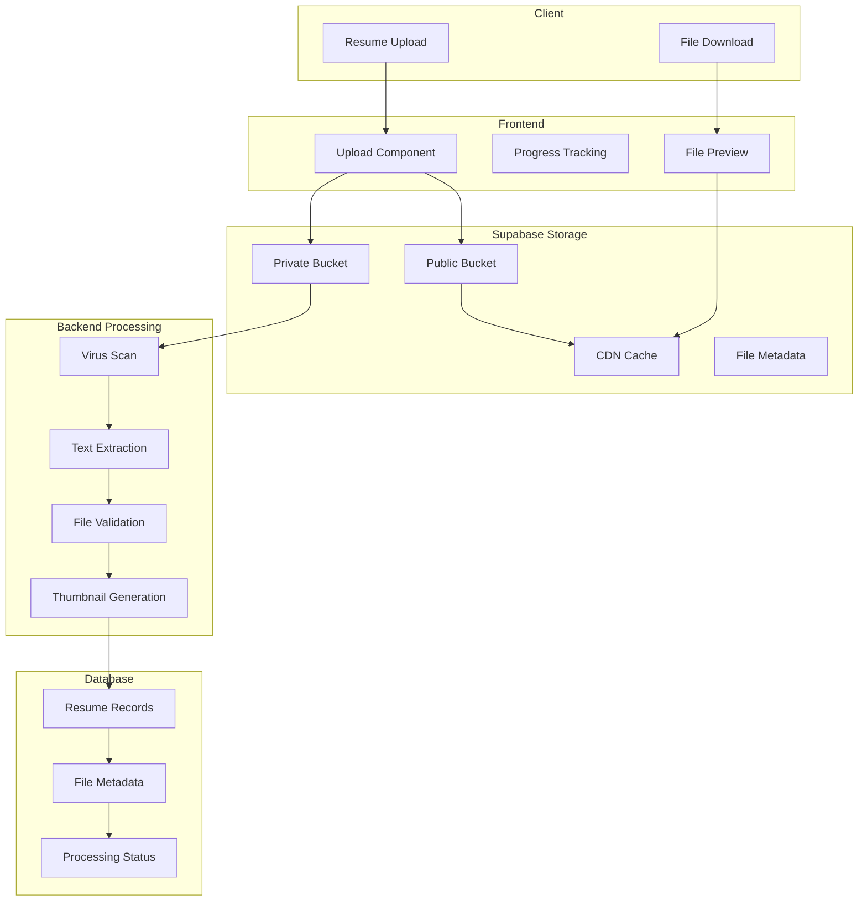

# File Storage Architecture

## Overview

The Resume-Matcher SaaS platform uses Supabase Storage for secure, scalable file management with comprehensive security policies, automatic virus scanning, and efficient CDN delivery.

## Storage Strategy

### Core Components
- **Primary Storage**: Supabase Storage (S3-compatible)
- **CDN**: Built-in CDN for global distribution
- **File Processing**: Background processing for text extraction
- **Security**: Row Level Security (RLS) and file encryption
- **Backup**: Automated backup and retention policies

## Storage Architecture



## Bucket Structure

### 1. Public Bucket (`public`)
- **Purpose**: Publicly accessible files (avatars, thumbnails)
- **Security**: Public read access
- **CDN**: Enabled for fast delivery
- **Path Structure**:
  ```
  public/
  ├── avatars/
  │   └── {user_id}/
  │       └── avatar.jpg
  ├── thumbnails/
  │   └── {user_id}/
  │       └── {resume_id}_thumb.png
  └── assets/
      ├── templates/
      └── examples/
  ```

### 2. Private Bucket (`private`)
- **Purpose**: User resumes and sensitive documents
- **Security**: RLS policies for user access only
- **Encryption**: Server-side encryption enabled
- **Path Structure**:
  ```
  private/
  └── resumes/
      └── {user_id}/
          ├── {resume_id}/
          │   ├── original.pdf
          │   ├── processed.txt
          │   └── metadata.json
          └── archived/
              └── {resume_id}_archived.pdf
  ```

## File Upload Implementation

### Frontend Upload Component

```typescript
// components/FileUpload.tsx
import { useState } from 'react'
import { supabase } from '@/lib/supabase'
import { useAuth } from '@/contexts/AuthContext'

interface FileUploadProps {
  onUploadComplete: (fileData: any) => void
  maxFileSize?: number
  acceptedTypes?: string[]
}

export const FileUpload = ({ 
  onUploadComplete,
  maxFileSize = 10 * 1024 * 1024, // 10MB
  acceptedTypes = ['.pdf', '.doc', '.docx']
}: FileUploadProps) => {
  const { user } = useAuth()
  const [uploading, setUploading] = useState(false)
  const [progress, setProgress] = useState(0)
  const [error, setError] = useState<string | null>(null)

  const uploadFile = async (file: File) => {
    if (!user) throw new Error('User not authenticated')
    
    // Validate file
    if (file.size > maxFileSize) {
      throw new Error(`File size must be less than ${maxFileSize / 1024 / 1024}MB`)
    }
    
    const fileExtension = file.name.split('.').pop()?.toLowerCase()
    if (!acceptedTypes.some(type => type.includes(fileExtension!))) {
      throw new Error('File type not supported')
    }

    setUploading(true)
    setError(null)
    
    try {
      // Generate unique filename
      const resumeId = crypto.randomUUID()
      const fileName = `${resumeId}/original.${fileExtension}`
      const filePath = `resumes/${user.id}/${fileName}`

      // Upload to Supabase Storage
      const { data, error: uploadError } = await supabase.storage
        .from('private')
        .upload(filePath, file, {
          onProgress: (progress) => {
            setProgress((progress.loaded / progress.total) * 100)
          },
          metadata: {
            resumeId,
            originalName: file.name,
            uploadedAt: new Date().toISOString()
          }
        })

      if (uploadError) throw uploadError

      // Create database record
      const { data: resumeData, error: dbError } = await supabase
        .from('resumes')
        .insert({
          id: resumeId,
          user_id: user.id,
          title: file.name.replace(/\.[^/.]+$/, ""),
          filename: file.name,
          file_path: data.path,
          file_size: file.size,
          mime_type: file.type,
          status: 'processing'
        })
        .select()
        .single()

      if (dbError) throw dbError

      // Trigger background processing
      await fetch('/api/process-resume', {
        method: 'POST',
        headers: { 'Content-Type': 'application/json' },
        body: JSON.stringify({ resumeId, filePath: data.path })
      })

      onUploadComplete(resumeData)
    } catch (err) {
      setError(err instanceof Error ? err.message : 'Upload failed')
    } finally {
      setUploading(false)
      setProgress(0)
    }
  }

  return (
    <div className="file-upload">
      <input
        type="file"
        accept={acceptedTypes.join(',')}
        onChange={(e) => {
          const file = e.target.files?.[0]
          if (file) uploadFile(file)
        }}
        disabled={uploading}
      />
      
      {uploading && (
        <div className="progress-bar">
          <div 
            className="progress-fill" 
            style={{ width: `${progress}%` }}
          />
          <span>{Math.round(progress)}%</span>
        </div>
      )}
      
      {error && (
        <div className="error-message">{error}</div>
      )}
    </div>
  )
}
```

### Backend File Processing

```python
# services/file_processor.py
import asyncio
import os
from typing import Optional
from supabase import create_client, Client
import PyPDF2
import docx
import magic
from PIL import Image
import io

class FileProcessor:
    def __init__(self):
        self.supabase: Client = create_client(
            os.getenv("SUPABASE_URL"),
            os.getenv("SUPABASE_SERVICE_KEY")
        )
    
    async def process_resume(self, resume_id: str, file_path: str):
        """Process uploaded resume file"""
        try:
            # Update status to processing
            await self.update_resume_status(resume_id, 'processing')
            
            # Download file from storage
            file_data = await self.download_file(file_path)
            
            # Validate file type
            if not await self.validate_file(file_data):
                raise Exception("Invalid or malicious file detected")
            
            # Extract text content
            text_content = await self.extract_text(file_data, file_path)
            
            # Generate thumbnail
            thumbnail_path = await self.generate_thumbnail(file_data, resume_id)
            
            # Update database with processed data
            await self.update_resume_data(resume_id, {
                'content_text': text_content,
                'thumbnail_path': thumbnail_path,
                'status': 'completed'
            })
            
        except Exception as e:
            # Update status to failed
            await self.update_resume_status(resume_id, 'failed', str(e))
            raise
    
    async def download_file(self, file_path: str) -> bytes:
        """Download file from Supabase Storage"""
        response = self.supabase.storage.from_('private').download(file_path)
        return response
    
    async def validate_file(self, file_data: bytes) -> bool:
        """Validate file type and scan for malicious content"""
        # Check MIME type
        mime = magic.from_buffer(file_data, mime=True)
        allowed_types = [
            'application/pdf',
            'application/msword',
            'application/vnd.openxmlformats-officedocument.wordprocessingml.document'
        ]
        
        if mime not in allowed_types:
            return False
        
        # Add virus scanning here if needed
        # This could integrate with ClamAV or similar
        
        return True
    
    async def extract_text(self, file_data: bytes, file_path: str) -> str:
        """Extract text content from file"""
        file_extension = file_path.split('.')[-1].lower()
        
        if file_extension == 'pdf':
            return await self.extract_pdf_text(file_data)
        elif file_extension in ['doc', 'docx']:
            return await self.extract_docx_text(file_data)
        else:
            raise Exception(f"Unsupported file type: {file_extension}")
    
    async def extract_pdf_text(self, file_data: bytes) -> str:
        """Extract text from PDF file"""
        pdf_file = io.BytesIO(file_data)
        pdf_reader = PyPDF2.PdfReader(pdf_file)
        
        text = ""
        for page in pdf_reader.pages:
            text += page.extract_text() + "\n"
        
        return text.strip()
    
    async def extract_docx_text(self, file_data: bytes) -> str:
        """Extract text from DOCX file"""
        doc_file = io.BytesIO(file_data)
        doc = docx.Document(doc_file)
        
        text = ""
        for paragraph in doc.paragraphs:
            text += paragraph.text + "\n"
        
        return text.strip()
    
    async def generate_thumbnail(self, file_data: bytes, resume_id: str) -> Optional[str]:
        """Generate thumbnail for resume (PDF first page)"""
        try:
            # For PDFs, convert first page to image
            # This would require pdf2image library
            # Implementation depends on your thumbnail strategy
            
            # Upload thumbnail to public bucket
            thumbnail_path = f"thumbnails/{resume_id}_thumb.png"
            
            # Return thumbnail path
            return thumbnail_path
            
        except Exception:
            # Thumbnail generation is optional
            return None
    
    async def update_resume_status(self, resume_id: str, status: str, error_message: str = None):
        """Update resume processing status"""
        update_data = {'status': status}
        if error_message:
            update_data['error_message'] = error_message
        
        self.supabase.table('resumes').update(update_data).eq('id', resume_id).execute()
    
    async def update_resume_data(self, resume_id: str, data: dict):
        """Update resume with processed data"""
        self.supabase.table('resumes').update(data).eq('id', resume_id).execute()
```

## Storage Security Policies

### Row Level Security (RLS) Policies

```sql
-- Enable RLS on storage objects
ALTER TABLE storage.objects ENABLE ROW LEVEL SECURITY;

-- Policy for private resume files
CREATE POLICY "Users can access own resume files" ON storage.objects
FOR ALL USING (
  bucket_id = 'private' AND
  (auth.uid())::text = (storage.foldername(name))[1]
);

-- Policy for public thumbnails
CREATE POLICY "Public thumbnail access" ON storage.objects
FOR SELECT USING (
  bucket_id = 'public' AND
  (storage.foldername(name))[1] = 'thumbnails'
);

-- Policy for avatar uploads
CREATE POLICY "Users can manage own avatars" ON storage.objects
FOR ALL USING (
  bucket_id = 'public' AND
  (storage.foldername(name))[1] = 'avatars' AND
  (auth.uid())::text = (storage.foldername(name))[2]
);
```

### File Access Controls

```typescript
// lib/fileAccess.ts
export class FileAccessManager {
  constructor(private supabase: SupabaseClient) {}

  async getSignedUrl(filePath: string, expiresIn: number = 3600): Promise<string> {
    const { data, error } = await this.supabase.storage
      .from('private')
      .createSignedUrl(filePath, expiresIn)
    
    if (error) throw error
    return data.signedUrl
  }

  async getPublicUrl(filePath: string): Promise<string> {
    const { data } = this.supabase.storage
      .from('public')
      .getPublicUrl(filePath)
    
    return data.publicUrl
  }

  async deleteFile(filePath: string): Promise<void> {
    const { error } = await this.supabase.storage
      .from('private')
      .remove([filePath])
    
    if (error) throw error
  }

  async moveFile(fromPath: string, toPath: string): Promise<void> {
    const { error } = await this.supabase.storage
      .from('private')
      .move(fromPath, toPath)
    
    if (error) throw error
  }
}
```

## File Operations

### 1. Secure Download Implementation

```typescript
// pages/api/files/[...path].ts
import { NextApiRequest, NextApiResponse } from 'next'
import { createServerSupabaseClient } from '@supabase/auth-helpers-nextjs'

export default async function handler(req: NextApiRequest, res: NextApiResponse) {
  if (req.method !== 'GET') {
    return res.status(405).json({ error: 'Method not allowed' })
  }

  const supabase = createServerSupabaseClient({ req, res })
  
  // Verify user authentication
  const { data: { session } } = await supabase.auth.getSession()
  if (!session) {
    return res.status(401).json({ error: 'Unauthorized' })
  }

  const filePath = (req.query.path as string[]).join('/')
  
  // Verify user owns the file
  const pathParts = filePath.split('/')
  const userId = pathParts[1] // resumes/{user_id}/...
  
  if (session.user.id !== userId) {
    return res.status(403).json({ error: 'Access denied' })
  }

  try {
    // Get signed URL for file
    const { data, error } = await supabase.storage
      .from('private')
      .createSignedUrl(filePath, 60) // 1 minute expiry
    
    if (error) throw error
    
    // Redirect to signed URL
    res.redirect(data.signedUrl)
  } catch (error) {
    res.status(500).json({ error: 'File access failed' })
  }
}
```

### 2. Batch File Operations

```typescript
// services/batchFileOperations.ts
export class BatchFileOperations {
  constructor(private supabase: SupabaseClient) {}

  async deleteUserFiles(userId: string): Promise<void> {
    // List all user files
    const { data: files, error: listError } = await this.supabase.storage
      .from('private')
      .list(`resumes/${userId}`, {
        limit: 1000,
        sortBy: { column: 'created_at', order: 'desc' }
      })

    if (listError) throw listError

    // Delete all files
    const filePaths = files.map(file => `resumes/${userId}/${file.name}`)
    const { error: deleteError } = await this.supabase.storage
      .from('private')
      .remove(filePaths)

    if (deleteError) throw deleteError
  }

  async archiveOldFiles(daysOld: number = 365): Promise<void> {
    // Implementation for archiving old files
    // This could move files to a cheaper storage tier
  }

  async cleanupFailedUploads(): Promise<void> {
    // Clean up files that failed processing
    // Remove orphaned files without database records
  }
}
```

## Performance Optimization

### 1. CDN Configuration

```typescript
// CDN settings for public files
const cdnConfig = {
  cacheControl: 'public, max-age=31536000', // 1 year
  headers: {
    'Cache-Control': 'public, max-age=31536000',
    'Content-Disposition': 'inline'
  }
}
```

### 2. File Compression

```python
# services/fileCompression.py
import gzip
import io

class FileCompressor:
    @staticmethod
    def compress_text(text: str) -> bytes:
        """Compress text content for storage"""
        return gzip.compress(text.encode('utf-8'))
    
    @staticmethod
    def decompress_text(compressed_data: bytes) -> str:
        """Decompress text content"""
        return gzip.decompress(compressed_data).decode('utf-8')
```

## Monitoring & Analytics

### File Storage Metrics

```typescript
// Track file operations
const trackFileOperation = async (operation: string, fileSize: number, userId: string) => {
  await supabase.from('file_operations').insert({
    user_id: userId,
    operation,
    file_size: fileSize,
    timestamp: new Date().toISOString()
  })
}

// Monitor storage usage
const getStorageUsage = async (userId: string) => {
  const { data, error } = await supabase.rpc('calculate_user_storage', {
    user_id: userId
  })
  
  return data?.total_size || 0
}
```

### Storage Alerts

```sql
-- Function to check storage limits
CREATE OR REPLACE FUNCTION check_storage_limit()
RETURNS trigger AS $$
BEGIN
  -- Check if user exceeds storage limit
  -- Send alert if near limit
  RETURN NEW;
END;
$$ LANGUAGE plpgsql;

-- Trigger on file uploads
CREATE TRIGGER storage_limit_check
  AFTER INSERT ON storage.objects
  FOR EACH ROW
  EXECUTE FUNCTION check_storage_limit();
```

## Compliance & Data Protection

### GDPR Compliance

```typescript
// User data deletion (Right to be forgotten)
export const deleteUserData = async (userId: string) => {
  // Delete all user files
  await batchFileOperations.deleteUserFiles(userId)
  
  // Remove database records
  await supabase.from('resumes').delete().eq('user_id', userId)
  
  // Log deletion for audit
  await supabase.from('audit_logs').insert({
    action: 'user_data_deleted',
    user_id: userId,
    timestamp: new Date().toISOString()
  })
}
```

### Data Encryption

```typescript
// Client-side encryption for sensitive files
import CryptoJS from 'crypto-js'

export const encryptFile = (fileBuffer: ArrayBuffer, key: string): ArrayBuffer => {
  const wordArray = CryptoJS.lib.WordArray.create(fileBuffer)
  const encrypted = CryptoJS.AES.encrypt(wordArray, key)
  return encrypted.ciphertext.words
}

export const decryptFile = (encryptedData: ArrayBuffer, key: string): ArrayBuffer => {
  const encrypted = CryptoJS.lib.CipherParams.create({
    ciphertext: CryptoJS.lib.WordArray.create(encryptedData)
  })
  const decrypted = CryptoJS.AES.decrypt(encrypted, key)
  return decrypted.words
}
```

---

**Next Steps**: Review `security/file-security.md` for additional file security measures and `api/endpoints/` for file management API endpoints.