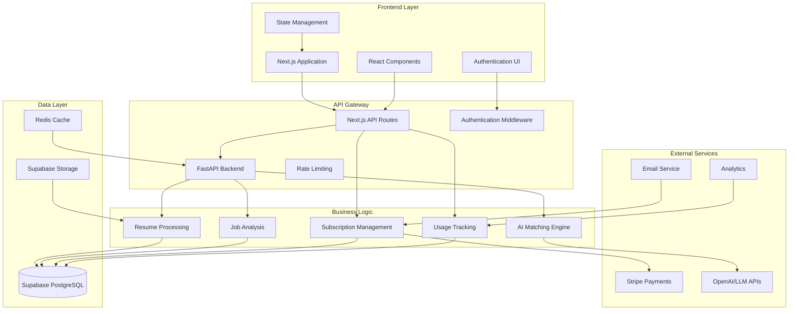

# Resume-Matcher SaaS Architecture Overview

## 🏗️ System Architecture

Resume-Matcher SaaS is designed as a modern, scalable platform that transforms the existing open-source resume matching tool into a comprehensive subscription-based service.



## 🔄 Data Flow Architecture

### 1. User Registration & Authentication
```
User → Frontend → Supabase Auth → Database Profile Creation → Welcome Email
```

### 2. Resume Upload & Processing
```
File Upload → Supabase Storage → Background Job → AI Processing → Structured Data → Database
```

### 3. Job Analysis & Matching
```
Job Input → Text Processing → AI Analysis → Keyword Extraction → Matching Algorithm → Results
```

### 4. Subscription Management
```
Plan Selection → Stripe Checkout → Webhook → Database Update → Feature Access
```

## 🎯 Core Components

### Frontend (Next.js + React)
- **Pages**: Landing, dashboard, pricing, account management
- **Components**: Resume uploader, job input, results display, billing
- **State**: Redux/Zustand for complex state, React Query for server state
- **Styling**: Tailwind CSS with component library (shadcn/ui)

### Backend API (FastAPI + Next.js)
- **FastAPI**: AI processing, heavy computations, resume parsing
- **Next.js API**: Authentication, subscriptions, CRUD operations
- **Middleware**: Rate limiting, authentication, error handling
- **Background Jobs**: Async processing for AI operations

### Database (Supabase PostgreSQL)
- **Auth**: User management with Row Level Security
- **Core Data**: Resumes, jobs, analyses, subscriptions
- **Analytics**: Usage tracking, performance metrics
- **Configuration**: Admin settings, feature flags

### File Storage (Supabase Storage)
- **Resume Files**: Original PDFs/DOCX with access controls
- **Generated Content**: Processed resumes, reports, exports
- **Templates**: Resume templates and assets
- **Security**: Signed URLs, file type validation

### Payment Processing (Stripe)
- **Subscriptions**: Recurring billing with multiple tiers
- **Webhooks**: Real-time subscription status updates
- **Customer Portal**: Self-service billing management
- **Analytics**: Revenue tracking and churn analysis

## 🏛️ Service Architecture

### Microservices Approach
While starting as a monolith, the architecture supports evolution to microservices:

1. **Authentication Service** (Supabase Auth)
2. **Resume Processing Service** (FastAPI)
3. **Matching Engine Service** (FastAPI + AI)
4. **Subscription Service** (Next.js + Stripe)
5. **Analytics Service** (Background processing)

### API Design Philosophy
- **RESTful**: Standard HTTP methods and status codes
- **Versioned**: `/api/v1/` prefix for future compatibility
- **Documented**: OpenAPI/Swagger specifications
- **Consistent**: Standardized error responses and data formats

## 📊 Scalability Considerations

### Horizontal Scaling
- **Stateless Services**: All services can be horizontally scaled
- **Database Sharding**: User-based sharding for large-scale operations
- **CDN Integration**: Static assets served via CDN
- **Caching**: Redis for session data and frequently accessed content

### Performance Optimization
- **Database Indexing**: Optimized queries with proper indexes
- **Background Processing**: Async operations for heavy tasks
- **Lazy Loading**: Frontend components loaded on demand
- **API Caching**: Response caching for read-heavy operations

### Monitoring & Observability
- **Application Metrics**: Response times, error rates, throughput
- **Business Metrics**: User engagement, conversion rates, churn
- **Infrastructure Metrics**: CPU, memory, database performance
- **Real-time Alerts**: Critical error notifications

## 🔒 Security Architecture

### Authentication & Authorization
- **Multi-factor Authentication**: Optional 2FA for enhanced security
- **Row Level Security**: Database-level access controls
- **JWT Tokens**: Secure session management
- **Role-based Access**: Admin, user, and service roles

### Data Protection
- **Encryption**: Data encrypted at rest and in transit
- **PII Handling**: Secure processing of personal information
- **File Security**: Virus scanning, file type validation
- **Audit Logging**: Comprehensive activity tracking

### Compliance
- **GDPR**: Right to deletion, data portability, consent management
- **SOC 2**: Security controls and monitoring
- **Privacy**: Transparent data usage policies

## 🚀 Deployment Architecture

### Environment Strategy
- **Development**: Local development with Docker
- **Staging**: Production-like environment for testing
- **Production**: Multi-region deployment for reliability

### Infrastructure as Code
- **Database Migrations**: Version-controlled schema changes
- **Configuration Management**: Environment-specific settings
- **Automated Deployment**: CI/CD pipelines with automated testing

### Disaster Recovery
- **Database Backups**: Automated daily backups with point-in-time recovery
- **File Backup**: Redundant storage across multiple regions
- **Monitoring**: Health checks and automated failover

## 📈 Growth Planning

### User Growth Stages
1. **0-1K users**: Single-server deployment
2. **1K-10K users**: Load balancer + multiple app servers
3. **10K-100K users**: Database optimization + caching layer
4. **100K+ users**: Microservices migration + advanced scaling

### Feature Evolution
1. **MVP**: Core resume matching functionality
2. **Enhanced**: Premium templates, advanced analytics
3. **Enterprise**: API access, white-label, team features
4. **AI Platform**: Custom AI models, industry-specific matching

## 🔧 Technology Decisions

### Why Supabase?
- **Rapid Development**: Built-in auth, real-time, and storage
- **PostgreSQL**: Powerful relational database with JSON support
- **Scalability**: Handles growth from startup to enterprise
- **Developer Experience**: Excellent tooling and documentation

### Why FastAPI + Next.js Hybrid?
- **FastAPI**: Optimal for AI/ML workloads and data processing
- **Next.js**: Excellent for frontend and simple API routes
- **Type Safety**: Full TypeScript support across the stack
- **Performance**: Each tool optimized for its use case

### Why Stripe?
- **Reliability**: Industry-leading payment processing
- **Features**: Advanced subscription management and analytics
- **Global**: Supports international payments and tax handling
- **Developer Tools**: Excellent API and testing tools

## 📋 Implementation Checklist

### Phase 1: Foundation
- [ ] Set up Supabase project and database schema
- [ ] Implement user authentication and profiles
- [ ] Create basic subscription management
- [ ] Build core resume upload functionality

### Phase 2: Core Features
- [ ] Integrate AI resume processing pipeline
- [ ] Implement job analysis and matching
- [ ] Add usage tracking and limits
- [ ] Create user dashboard and results display

### Phase 3: Business Features
- [ ] Build pricing page and subscription flows
- [ ] Implement Stripe webhook processing
- [ ] Add admin dashboard for user management
- [ ] Create analytics and reporting features

### Phase 4: Polish & Scale
- [ ] Performance optimization and caching
- [ ] Enhanced security and compliance features
- [ ] Mobile responsiveness and PWA features
- [ ] Advanced analytics and business intelligence

---

This architecture provides a solid foundation for building a scalable, secure, and maintainable SaaS platform while preserving the core AI capabilities that make Resume-Matcher valuable.