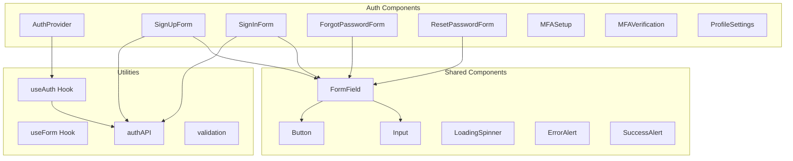

# Authentication Components

## Overview

This document outlines the frontend authentication components for the Resume-Matcher SaaS platform, built with React, TypeScript, and Tailwind CSS. All components follow modern accessibility standards and provide excellent user experience.

## Component Architecture



## Core Authentication Context

### AuthProvider Component

```typescript
// contexts/AuthContext.tsx
import React, { createContext, useContext, useEffect, useState, ReactNode } from 'react'
import { User, Session } from '@/types/auth'
import { authAPI } from '@/lib/api'
import { useRouter } from 'next/router'

interface AuthContextType {
  user: User | null
  session: Session | null
  loading: boolean
  signIn: (email: string, password: string) => Promise<void>
  signUp: (data: SignUpData) => Promise<void>
  signOut: () => Promise<void>
  resetPassword: (email: string) => Promise<void>
  updateProfile: (data: Partial<User>) => Promise<void>
  refreshSession: () => Promise<void>
}

interface SignUpData {
  email: string
  password: string
  full_name: string
  company?: string
  job_title?: string
}

const AuthContext = createContext<AuthContextType | undefined>(undefined)

interface AuthProviderProps {
  children: ReactNode
}

export const AuthProvider: React.FC<AuthProviderProps> = ({ children }) => {
  const [user, setUser] = useState<User | null>(null)
  const [session, setSession] = useState<Session | null>(null)
  const [loading, setLoading] = useState(true)
  const router = useRouter()

  useEffect(() => {
    initializeAuth()
  }, [])

  const initializeAuth = async () => {
    try {
      const { data } = await authAPI.getSession()
      setUser(data.user)
      setSession(data.session)
    } catch (error) {
      console.error('Failed to initialize auth:', error)
    } finally {
      setLoading(false)
    }
  }

  const signIn = async (email: string, password: string) => {
    try {
      const { data } = await authAPI.signIn({ email, password })
      setUser(data.user)
      setSession(data.session)
      
      // Redirect based on onboarding status
      if (!data.user.onboarding_completed) {
        router.push('/onboarding')
      } else {
        router.push('/dashboard')
      }
    } catch (error) {
      throw error
    }
  }

  const signUp = async (signUpData: SignUpData) => {
    try {
      await authAPI.signUp(signUpData)
      // Don't set user state - email verification required
      router.push('/auth/verify-email')
    } catch (error) {
      throw error
    }
  }

  const signOut = async () => {
    try {
      await authAPI.signOut()
      setUser(null)
      setSession(null)
      router.push('/')
    } catch (error) {
      console.error('Sign out error:', error)
      // Force logout on client side even if API fails
      setUser(null)
      setSession(null)
      router.push('/')
    }
  }

  const resetPassword = async (email: string) => {
    try {
      await authAPI.forgotPassword({ email })
    } catch (error) {
      throw error
    }
  }

  const updateProfile = async (profileData: Partial<User>) => {
    try {
      const { data } = await authAPI.updateProfile(profileData)
      setUser(data.user)
    } catch (error) {
      throw error
    }
  }

  const refreshSession = async () => {
    try {
      const { data } = await authAPI.refreshSession()
      setSession(data.session)
    } catch (error) {
      // If refresh fails, sign out user
      await signOut()
      throw error
    }
  }

  const value: AuthContextType = {
    user,
    session,
    loading,
    signIn,
    signUp,
    signOut,
    resetPassword,
    updateProfile,
    refreshSession
  }

  return (
    <AuthContext.Provider value={value}>
      {children}
    </AuthContext.Provider>
  )
}

export const useAuth = (): AuthContextType => {
  const context = useContext(AuthContext)
  if (context === undefined) {
    throw new Error('useAuth must be used within an AuthProvider')
  }
  return context
}
```

## Authentication Forms

### SignUpForm Component

```typescript
// components/auth/SignUpForm.tsx
import React, { useState } from 'react'
import { useForm } from 'react-hook-form'
import { zodResolver } from '@hookform/resolvers/zod'
import { z } from 'zod'
import { useAuth } from '@/contexts/AuthContext'
import { Button } from '@/components/ui/Button'
import { Input } from '@/components/ui/Input'
import { FormField } from '@/components/ui/FormField'
import { ErrorAlert } from '@/components/ui/ErrorAlert'
import { LoadingSpinner } from '@/components/ui/LoadingSpinner'
import Link from 'next/link'

const signUpSchema = z.object({
  email: z.string().email('Please enter a valid email address'),
  password: z
    .string()
    .min(8, 'Password must be at least 8 characters')
    .regex(/^(?=.*[a-z])(?=.*[A-Z])(?=.*\d)(?=.*[@$!%*?&])[A-Za-z\d@$!%*?&]/, 
      'Password must contain uppercase, lowercase, number, and special character'),
  confirmPassword: z.string(),
  full_name: z.string().min(2, 'Full name must be at least 2 characters'),
  company: z.string().optional(),
  job_title: z.string().optional(),
  terms: z.boolean().refine(val => val === true, 'You must agree to the terms')
}).refine(data => data.password === data.confirmPassword, {
  message: "Passwords don't match",
  path: ["confirmPassword"]
})

type SignUpFormData = z.infer<typeof signUpSchema>

export const SignUpForm: React.FC = () => {
  const { signUp } = useAuth()
  const [isLoading, setIsLoading] = useState(false)
  const [error, setError] = useState<string | null>(null)

  const {
    register,
    handleSubmit,
    formState: { errors, isValid }
  } = useForm<SignUpFormData>({
    resolver: zodResolver(signUpSchema),
    mode: 'onChange'
  })

  const onSubmit = async (data: SignUpFormData) => {
    setIsLoading(true)
    setError(null)

    try {
      await signUp({
        email: data.email,
        password: data.password,
        full_name: data.full_name,
        company: data.company,
        job_title: data.job_title
      })
    } catch (err: any) {
      setError(err.message || 'Failed to create account')
    } finally {
      setIsLoading(false)
    }
  }

  return (
    <div className="w-full max-w-md mx-auto">
      <div className="bg-white shadow-lg rounded-lg p-8">
        <div className="text-center mb-8">
          <h1 className="text-2xl font-bold text-gray-900">Create Account</h1>
          <p className="text-gray-600 mt-2">
            Start optimizing your resume today
          </p>
        </div>

        {error && (
          <ErrorAlert message={error} className="mb-6" />
        )}

        <form onSubmit={handleSubmit(onSubmit)} className="space-y-6">
          <FormField
            label="Full Name"
            error={errors.full_name?.message}
            required
          >
            <Input
              {...register('full_name')}
              type="text"
              placeholder="John Doe"
              disabled={isLoading}
            />
          </FormField>

          <FormField
            label="Email Address"
            error={errors.email?.message}
            required
          >
            <Input
              {...register('email')}
              type="email"
              placeholder="john@example.com"
              disabled={isLoading}
            />
          </FormField>

          <div className="grid grid-cols-1 md:grid-cols-2 gap-4">
            <FormField
              label="Company"
              error={errors.company?.message}
            >
              <Input
                {...register('company')}
                type="text"
                placeholder="TechCorp Inc."
                disabled={isLoading}
              />
            </FormField>

            <FormField
              label="Job Title"
              error={errors.job_title?.message}
            >
              <Input
                {...register('job_title')}
                type="text"
                placeholder="Software Engineer"
                disabled={isLoading}
              />
            </FormField>
          </div>

          <FormField
            label="Password"
            error={errors.password?.message}
            required
          >
            <Input
              {...register('password')}
              type="password"
              placeholder="••••••••"
              disabled={isLoading}
            />
          </FormField>

          <FormField
            label="Confirm Password"
            error={errors.confirmPassword?.message}
            required
          >
            <Input
              {...register('confirmPassword')}
              type="password"
              placeholder="••••••••"
              disabled={isLoading}
            />
          </FormField>

          <FormField error={errors.terms?.message}>
            <label className="flex items-start space-x-3">
              <input
                {...register('terms')}
                type="checkbox"
                className="mt-1 h-4 w-4 text-blue-600 focus:ring-blue-500 border-gray-300 rounded"
                disabled={isLoading}
              />
              <span className="text-sm text-gray-600">
                I agree to the{' '}
                <Link href="/terms" className="text-blue-600 hover:underline">
                  Terms of Service
                </Link>{' '}
                and{' '}
                <Link href="/privacy" className="text-blue-600 hover:underline">
                  Privacy Policy
                </Link>
              </span>
            </label>
          </FormField>

          <Button
            type="submit"
            className="w-full"
            disabled={isLoading || !isValid}
          >
            {isLoading ? (
              <LoadingSpinner size="sm" className="mr-2" />
            ) : null}
            Create Account
          </Button>
        </form>

        <div className="mt-6 text-center">
          <p className="text-sm text-gray-600">
            Already have an account?{' '}
            <Link href="/auth/signin" className="text-blue-600 hover:underline">
              Sign in
            </Link>
          </p>
        </div>

        <div className="mt-6">
          <div className="relative">
            <div className="absolute inset-0 flex items-center">
              <div className="w-full border-t border-gray-300" />
            </div>
            <div className="relative flex justify-center text-sm">
              <span className="px-2 bg-white text-gray-500">Or continue with</span>
            </div>
          </div>

          <div className="mt-6 grid grid-cols-2 gap-3">
            <SocialSignUpButton provider="google" disabled={isLoading} />
            <SocialSignUpButton provider="linkedin" disabled={isLoading} />
          </div>
        </div>
      </div>
    </div>
  )
}
```

### SignInForm Component

```typescript
// components/auth/SignInForm.tsx
import React, { useState } from 'react'
import { useForm } from 'react-hook-form'
import { zodResolver } from '@hookform/resolvers/zod'
import { z } from 'zod'
import { useAuth } from '@/contexts/AuthContext'
import { Button } from '@/components/ui/Button'
import { Input } from '@/components/ui/Input'
import { FormField } from '@/components/ui/FormField'
import { ErrorAlert } from '@/components/ui/ErrorAlert'
import { LoadingSpinner } from '@/components/ui/LoadingSpinner'
import Link from 'next/link'

const signInSchema = z.object({
  email: z.string().email('Please enter a valid email address'),
  password: z.string().min(1, 'Password is required'),
  remember_me: z.boolean().optional()
})

type SignInFormData = z.infer<typeof signInSchema>

export const SignInForm: React.FC = () => {
  const { signIn } = useAuth()
  const [isLoading, setIsLoading] = useState(false)
  const [error, setError] = useState<string | null>(null)

  const {
    register,
    handleSubmit,
    formState: { errors }
  } = useForm<SignInFormData>({
    resolver: zodResolver(signInSchema)
  })

  const onSubmit = async (data: SignInFormData) => {
    setIsLoading(true)
    setError(null)

    try {
      await signIn(data.email, data.password)
    } catch (err: any) {
      if (err.code === 'EMAIL_NOT_VERIFIED') {
        setError('Please verify your email address before signing in.')
      } else if (err.code === 'INVALID_CREDENTIALS') {
        setError('Invalid email or password.')
      } else if (err.code === 'ACCOUNT_LOCKED') {
        setError('Account temporarily locked. Please try again later.')
      } else {
        setError(err.message || 'Failed to sign in')
      }
    } finally {
      setIsLoading(false)
    }
  }

  return (
    <div className="w-full max-w-md mx-auto">
      <div className="bg-white shadow-lg rounded-lg p-8">
        <div className="text-center mb-8">
          <h1 className="text-2xl font-bold text-gray-900">Welcome Back</h1>
          <p className="text-gray-600 mt-2">
            Sign in to your Resume-Matcher account
          </p>
        </div>

        {error && (
          <ErrorAlert message={error} className="mb-6" />
        )}

        <form onSubmit={handleSubmit(onSubmit)} className="space-y-6">
          <FormField
            label="Email Address"
            error={errors.email?.message}
            required
          >
            <Input
              {...register('email')}
              type="email"
              placeholder="john@example.com"
              disabled={isLoading}
              autoComplete="email"
            />
          </FormField>

          <FormField
            label="Password"
            error={errors.password?.message}
            required
          >
            <Input
              {...register('password')}
              type="password"
              placeholder="••••••••"
              disabled={isLoading}
              autoComplete="current-password"
            />
          </FormField>

          <div className="flex items-center justify-between">
            <label className="flex items-center">
              <input
                {...register('remember_me')}
                type="checkbox"
                className="h-4 w-4 text-blue-600 focus:ring-blue-500 border-gray-300 rounded"
                disabled={isLoading}
              />
              <span className="ml-2 text-sm text-gray-600">Remember me</span>
            </label>
            <Link
              href="/auth/forgot-password"
              className="text-sm text-blue-600 hover:underline"
            >
              Forgot password?
            </Link>
          </div>

          <Button type="submit" className="w-full" disabled={isLoading}>
            {isLoading ? (
              <LoadingSpinner size="sm" className="mr-2" />
            ) : null}
            Sign In
          </Button>
        </form>

        <div className="mt-6 text-center">
          <p className="text-sm text-gray-600">
            Don't have an account?{' '}
            <Link href="/auth/signup" className="text-blue-600 hover:underline">
              Sign up
            </Link>
          </p>
        </div>

        <div className="mt-6">
          <div className="relative">
            <div className="absolute inset-0 flex items-center">
              <div className="w-full border-t border-gray-300" />
            </div>
            <div className="relative flex justify-center text-sm">
              <span className="px-2 bg-white text-gray-500">Or continue with</span>
            </div>
          </div>

          <div className="mt-6 grid grid-cols-2 gap-3">
            <SocialSignInButton provider="google" disabled={isLoading} />
            <SocialSignInButton provider="linkedin" disabled={isLoading} />
          </div>
        </div>
      </div>
    </div>
  )
}
```

### Social Authentication Buttons

```typescript
// components/auth/SocialSignInButton.tsx
import React, { useState } from 'react'
import { Button } from '@/components/ui/Button'
import { LoadingSpinner } from '@/components/ui/LoadingSpinner'
import { authAPI } from '@/lib/api'

interface SocialSignInButtonProps {
  provider: 'google' | 'linkedin' | 'github'
  disabled?: boolean
  mode?: 'signin' | 'signup'
}

const providerConfig = {
  google: {
    name: 'Google',
    icon: GoogleIcon,
    className: 'border-gray-300 text-gray-700 hover:bg-gray-50'
  },
  linkedin: {
    name: 'LinkedIn',
    icon: LinkedInIcon,
    className: 'border-blue-500 text-blue-600 hover:bg-blue-50'
  },
  github: {
    name: 'GitHub',
    icon: GitHubIcon,
    className: 'border-gray-900 text-gray-900 hover:bg-gray-50'
  }
}

export const SocialSignInButton: React.FC<SocialSignInButtonProps> = ({
  provider,
  disabled = false,
  mode = 'signin'
}) => {
  const [isLoading, setIsLoading] = useState(false)
  const config = providerConfig[provider]

  const handleSocialAuth = async () => {
    setIsLoading(true)
    try {
      const { data } = await authAPI.socialSignIn({
        provider,
        redirect_url: `${window.location.origin}/auth/callback`
      })
      
      // Redirect to OAuth provider
      window.location.href = data.auth_url
    } catch (error) {
      console.error(`${provider} auth error:`, error)
      setIsLoading(false)
    }
  }

  return (
    <Button
      type="button"
      variant="outline"
      className={`w-full ${config.className}`}
      onClick={handleSocialAuth}
      disabled={disabled || isLoading}
    >
      {isLoading ? (
        <LoadingSpinner size="sm" className="mr-2" />
      ) : (
        <config.icon className="w-4 h-4 mr-2" />
      )}
      {mode === 'signup' ? `Sign up with ${config.name}` : config.name}
    </Button>
  )
}
```

## Multi-Factor Authentication

### MFASetup Component

```typescript
// components/auth/MFASetup.tsx
import React, { useState, useEffect } from 'react'
import { useForm } from 'react-hook-form'
import { authAPI } from '@/lib/api'
import { Button } from '@/components/ui/Button'
import { Input } from '@/components/ui/Input'
import { FormField } from '@/components/ui/FormField'
import { SuccessAlert } from '@/components/ui/SuccessAlert'
import { ErrorAlert } from '@/components/ui/ErrorAlert'
import QRCode from 'qrcode.react'

interface MFASetupProps {
  onComplete: () => void
}

export const MFASetup: React.FC<MFASetupProps> = ({ onComplete }) => {
  const [step, setStep] = useState<'enroll' | 'verify'>('enroll')
  const [factorData, setFactorData] = useState<any>(null)
  const [backupCodes, setBackupCodes] = useState<string[]>([])
  const [isLoading, setIsLoading] = useState(false)
  const [error, setError] = useState<string | null>(null)

  const { register, handleSubmit, formState: { errors } } = useForm()

  const enrollMFA = async () => {
    setIsLoading(true)
    setError(null)
    
    try {
      const { data } = await authAPI.mfaEnroll({
        factor_type: 'totp',
        friendly_name: 'My Device'
      })
      setFactorData(data)
      setStep('verify')
    } catch (err: any) {
      setError(err.message || 'Failed to set up MFA')
    } finally {
      setIsLoading(false)
    }
  }

  const verifyMFA = async (formData: { code: string }) => {
    setIsLoading(true)
    setError(null)
    
    try {
      const { data } = await authAPI.mfaVerify({
        factor_id: factorData.factor.id,
        code: formData.code
      })
      setBackupCodes(data.backup_codes)
      onComplete()
    } catch (err: any) {
      setError(err.message || 'Invalid verification code')
    } finally {
      setIsLoading(false)
    }
  }

  if (step === 'enroll') {
    return (
      <div className="max-w-md mx-auto">
        <div className="text-center mb-6">
          <h2 className="text-xl font-semibold">Set Up Two-Factor Authentication</h2>
          <p className="text-gray-600 mt-2">
            Add an extra layer of security to your account
          </p>
        </div>

        {error && <ErrorAlert message={error} className="mb-4" />}

        <div className="space-y-4">
          <div className="p-4 bg-blue-50 rounded-lg">
            <h3 className="font-medium text-blue-900">What you'll need:</h3>
            <ul className="mt-2 text-sm text-blue-800 list-disc list-inside">
              <li>A smartphone or tablet</li>
              <li>An authenticator app (Google Authenticator, Authy, etc.)</li>
            </ul>
          </div>

          <Button onClick={enrollMFA} disabled={isLoading} className="w-full">
            {isLoading ? 'Setting up...' : 'Set Up MFA'}
          </Button>
        </div>
      </div>
    )
  }

  return (
    <div className="max-w-md mx-auto">
      <div className="text-center mb-6">
        <h2 className="text-xl font-semibold">Scan QR Code</h2>
        <p className="text-gray-600 mt-2">
          Use your authenticator app to scan this QR code
        </p>
      </div>

      {error && <ErrorAlert message={error} className="mb-4" />}

      <div className="space-y-6">
        <div className="flex justify-center">
          <div className="p-4 bg-white border-2 border-gray-200 rounded-lg">
            <QRCode value={factorData.totp.uri} size={200} />
          </div>
        </div>

        <div className="text-center">
          <p className="text-sm text-gray-600 mb-2">
            Can't scan? Enter this code manually:
          </p>
          <code className="px-3 py-1 bg-gray-100 rounded text-sm font-mono">
            {factorData.totp.secret}
          </code>
        </div>

        <form onSubmit={handleSubmit(verifyMFA)} className="space-y-4">
          <FormField
            label="Verification Code"
            error={errors.code?.message}
            required
          >
            <Input
              {...register('code', { 
                required: 'Verification code is required',
                pattern: {
                  value: /^\d{6}$/,
                  message: 'Code must be 6 digits'
                }
              })}
              type="text"
              placeholder="123456"
              maxLength={6}
              className="text-center text-lg tracking-widest"
              disabled={isLoading}
            />
          </FormField>

          <Button type="submit" disabled={isLoading} className="w-full">
            {isLoading ? 'Verifying...' : 'Verify & Enable MFA'}
          </Button>
        </form>
      </div>

      {backupCodes.length > 0 && (
        <div className="mt-6 p-4 bg-yellow-50 border border-yellow-200 rounded-lg">
          <h3 className="font-medium text-yellow-900 mb-2">Backup Codes</h3>
          <p className="text-sm text-yellow-800 mb-3">
            Save these codes in a safe place. You can use them to access your account if you lose your device.
          </p>
          <div className="grid grid-cols-2 gap-2 text-sm font-mono">
            {backupCodes.map((code, index) => (
              <div key={index} className="p-2 bg-white rounded border">
                {code}
              </div>
            ))}
          </div>
        </div>
      )}
    </div>
  )
}
```

## Protected Route Component

```typescript
// components/auth/ProtectedRoute.tsx
import React, { useEffect } from 'react'
import { useAuth } from '@/contexts/AuthContext'
import { useRouter } from 'next/router'
import { LoadingSpinner } from '@/components/ui/LoadingSpinner'

interface ProtectedRouteProps {
  children: React.ReactNode
  requireAuth?: boolean
  requireVerifiedEmail?: boolean
  requireSubscription?: boolean
  allowedPlans?: string[]
  redirectTo?: string
}

export const ProtectedRoute: React.FC<ProtectedRouteProps> = ({
  children,
  requireAuth = true,
  requireVerifiedEmail = true,
  requireSubscription = false,
  allowedPlans = [],
  redirectTo = '/auth/signin'
}) => {
  const { user, session, loading } = useAuth()
  const router = useRouter()

  useEffect(() => {
    if (loading) return

    // Check authentication
    if (requireAuth && !session) {
      router.push(redirectTo)
      return
    }

    // Check email verification
    if (requireVerifiedEmail && user && !user.email_confirmed) {
      router.push('/auth/verify-email')
      return
    }

    // Check subscription
    if (requireSubscription && user && !user.subscription?.status === 'active') {
      router.push('/pricing')
      return
    }

    // Check plan access
    if (allowedPlans.length > 0 && user?.subscription) {
      if (!allowedPlans.includes(user.subscription.plan)) {
        router.push('/pricing')
        return
      }
    }
  }, [user, session, loading, router])

  if (loading) {
    return (
      <div className="min-h-screen flex items-center justify-center">
        <LoadingSpinner size="lg" />
      </div>
    )
  }

  if (requireAuth && !session) {
    return null
  }

  if (requireVerifiedEmail && user && !user.email_confirmed) {
    return null
  }

  return <>{children}</>
}
```

## Form Validation Utilities

```typescript
// lib/validation.ts
import { z } from 'zod'

export const passwordSchema = z
  .string()
  .min(8, 'Password must be at least 8 characters')
  .regex(
    /^(?=.*[a-z])(?=.*[A-Z])(?=.*\d)(?=.*[@$!%*?&])[A-Za-z\d@$!%*?&]/,
    'Password must contain uppercase, lowercase, number, and special character'
  )

export const emailSchema = z
  .string()
  .email('Please enter a valid email address')
  .min(1, 'Email is required')

export const nameSchema = z
  .string()
  .min(2, 'Name must be at least 2 characters')
  .max(100, 'Name must be less than 100 characters')

// Password strength checker
export const getPasswordStrength = (password: string): {
  score: number
  feedback: string[]
} => {
  let score = 0
  const feedback: string[] = []

  if (password.length >= 8) score += 1
  else feedback.push('Use at least 8 characters')

  if (/[a-z]/.test(password)) score += 1
  else feedback.push('Add a lowercase letter')

  if (/[A-Z]/.test(password)) score += 1
  else feedback.push('Add an uppercase letter')

  if (/\d/.test(password)) score += 1
  else feedback.push('Add a number')

  if (/[@$!%*?&]/.test(password)) score += 1
  else feedback.push('Add a special character')

  return { score, feedback }
}
```

## Styling and Accessibility

### CSS Classes (Tailwind)

```css
/* Custom auth form styles */
.auth-form {
  @apply w-full max-w-md mx-auto;
}

.auth-card {
  @apply bg-white shadow-lg rounded-lg p-8;
}

.auth-header {
  @apply text-center mb-8;
}

.auth-title {
  @apply text-2xl font-bold text-gray-900;
}

.auth-subtitle {
  @apply text-gray-600 mt-2;
}

.auth-divider {
  @apply relative flex justify-center text-sm;
}

.auth-divider::before {
  @apply absolute inset-0 flex items-center;
  content: '';
}

.auth-divider::before > div {
  @apply w-full border-t border-gray-300;
}

.social-button {
  @apply w-full justify-center py-2 px-4 border border-gray-300 rounded-md shadow-sm text-sm font-medium text-gray-700 bg-white hover:bg-gray-50 focus:outline-none focus:ring-2 focus:ring-offset-2 focus:ring-blue-500;
}
```

### Accessibility Features

- **ARIA Labels**: All form inputs have proper labels and ARIA attributes
- **Keyboard Navigation**: Full keyboard support for all interactive elements
- **Screen Reader Support**: Proper heading hierarchy and descriptive text
- **Color Contrast**: WCAG AA compliant color combinations
- **Focus Management**: Clear focus indicators and logical tab order
- **Error Handling**: Clear error messages associated with form fields

## Testing Strategy

### Unit Tests Example

```typescript
// __tests__/components/auth/SignInForm.test.tsx
import { render, screen, fireEvent, waitFor } from '@testing-library/react'
import { SignInForm } from '@/components/auth/SignInForm'
import { AuthProvider } from '@/contexts/AuthContext'

const MockAuthProvider = ({ children }: { children: React.ReactNode }) => (
  <AuthProvider>{children}</AuthProvider>
)

describe('SignInForm', () => {
  it('renders sign in form correctly', () => {
    render(
      <MockAuthProvider>
        <SignInForm />
      </MockAuthProvider>
    )

    expect(screen.getByLabelText(/email address/i)).toBeInTheDocument()
    expect(screen.getByLabelText(/password/i)).toBeInTheDocument()
    expect(screen.getByRole('button', { name: /sign in/i })).toBeInTheDocument()
  })

  it('shows validation errors for invalid input', async () => {
    render(
      <MockAuthProvider>
        <SignInForm />
      </MockAuthProvider>
    )

    const emailInput = screen.getByLabelText(/email address/i)
    const submitButton = screen.getByRole('button', { name: /sign in/i })

    fireEvent.change(emailInput, { target: { value: 'invalid-email' } })
    fireEvent.click(submitButton)

    await waitFor(() => {
      expect(screen.getByText(/please enter a valid email address/i)).toBeInTheDocument()
    })
  })
})
```

---

**Next Steps**: Review `dashboard.md` for main application components and `subscription-management.md` for billing-related UI components.