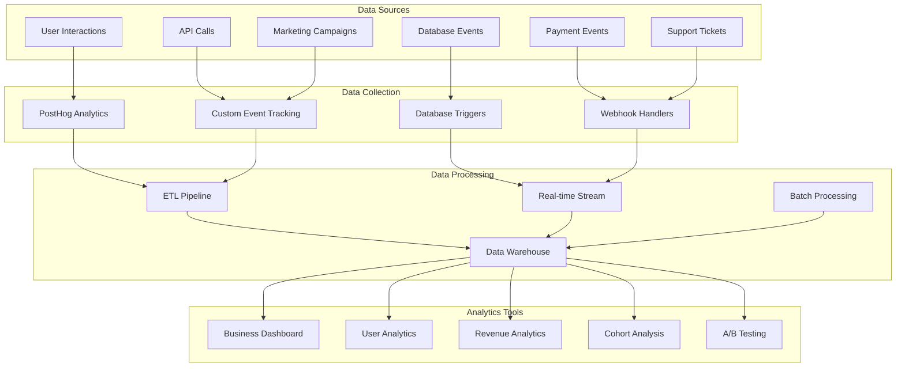

# Analytics & Business Intelligence

## Overview

This document outlines the comprehensive analytics and business intelligence strategy for the Resume-Matcher SaaS platform, covering user behavior analytics, business metrics, performance monitoring, and data-driven decision making.

## Analytics Architecture



## Key Performance Indicators (KPIs)

### 1. User Acquisition Metrics

#### Traffic Sources
```typescript
interface TrafficMetrics {
  organic_search: number
  paid_search: number
  social_media: number
  direct: number
  referral: number
  email: number
}

// Track user acquisition sources
const trackUserAcquisition = (userId: string, source: string, medium: string, campaign?: string) => {
  posthog.capture('user_acquisition', {
    user_id: userId,
    source,
    medium,
    campaign,
    landing_page: window.location.pathname,
    referrer: document.referrer,
    utm_params: getUTMParameters()
  })
}
```

#### Conversion Funnel
- **Website Visits**: Total unique visitors
- **Sign-up Rate**: Visitors who create accounts (target: 5-10%)
- **Email Verification**: Users who verify email (target: 80%+)
- **Onboarding Completion**: Users who complete onboarding (target: 70%+)
- **First Resume Upload**: Users who upload first resume (target: 60%+)
- **Free to Paid Conversion**: Users who upgrade to paid plans (target: 15%+)

### 2. User Engagement Metrics

#### Daily/Weekly/Monthly Active Users
```sql
-- Calculate DAU, WAU, MAU
WITH user_activity AS (
  SELECT 
    user_id,
    DATE(created_at) as activity_date,
    COUNT(*) as actions
  FROM usage_events 
  WHERE created_at >= CURRENT_DATE - INTERVAL '30 days'
  GROUP BY user_id, DATE(created_at)
)
SELECT 
  'DAU' as metric,
  COUNT(DISTINCT user_id) as value
FROM user_activity 
WHERE activity_date = CURRENT_DATE

UNION ALL

SELECT 
  'WAU' as metric,
  COUNT(DISTINCT user_id) as value
FROM user_activity 
WHERE activity_date >= CURRENT_DATE - INTERVAL '7 days'

UNION ALL

SELECT 
  'MAU' as metric,
  COUNT(DISTINCT user_id) as value
FROM user_activity;
```

#### Feature Adoption
```typescript
interface FeatureUsage {
  resume_upload: number
  job_analysis: number
  advanced_analytics: number
  api_usage: number
  team_collaboration: number
  export_features: number
}

// Track feature usage
const trackFeatureUsage = (feature: string, userId: string, metadata?: object) => {
  posthog.capture('feature_used', {
    feature,
    user_id: userId,
    plan: userPlan,
    ...metadata
  })
}
```

#### Session Analytics
- **Session Duration**: Average time spent per session
- **Pages per Session**: Number of pages/views per session
- **Bounce Rate**: Single-page sessions percentage
- **Return Visitor Rate**: Percentage of returning users

### 3. Revenue Metrics

#### Monthly Recurring Revenue (MRR)
```sql
-- Calculate MRR by plan
SELECT 
  sp.name as plan_name,
  sp.price_monthly,
  COUNT(s.id) as active_subscriptions,
  COUNT(s.id) * sp.price_monthly as mrr
FROM subscriptions s
JOIN subscription_plans sp ON s.plan_id = sp.id
WHERE s.status = 'active'
GROUP BY sp.id, sp.name, sp.price_monthly
ORDER BY mrr DESC;
```

#### Customer Lifetime Value (CLV)
```typescript
interface CLVCalculation {
  averageMonthlyRevenue: number
  averageCustomerLifespan: number // months
  customerAcquisitionCost: number
  grossMargin: number // percentage
}

const calculateCLV = (metrics: CLVCalculation): number => {
  const { averageMonthlyRevenue, averageCustomerLifespan, grossMargin } = metrics
  return (averageMonthlyRevenue * averageCustomerLifespan * grossMargin) / 100
}

const calculateCAC = (marketingSpend: number, newCustomers: number): number => {
  return marketingSpend / newCustomers
}
```

#### Churn Analysis
```sql
-- Monthly churn rate calculation
WITH monthly_cohorts AS (
  SELECT 
    DATE_TRUNC('month', created_at) as cohort_month,
    user_id
  FROM subscriptions
  WHERE status = 'active'
),
churn_events AS (
  SELECT 
    user_id,
    DATE_TRUNC('month', updated_at) as churn_month
  FROM subscriptions
  WHERE status = 'canceled'
)
SELECT 
  mc.cohort_month,
  COUNT(mc.user_id) as cohort_size,
  COUNT(ce.user_id) as churned_users,
  ROUND(COUNT(ce.user_id)::numeric / COUNT(mc.user_id) * 100, 2) as churn_rate
FROM monthly_cohorts mc
LEFT JOIN churn_events ce ON mc.user_id = ce.user_id
GROUP BY mc.cohort_month
ORDER BY mc.cohort_month;
```

### 4. Product Usage Metrics

#### Resume Analysis Performance
```typescript
interface AnalysisMetrics {
  totalAnalyses: number
  averageProcessingTime: number
  successRate: number
  userSatisfactionScore: number
  repeatUsageRate: number
}

// Track analysis performance
const trackAnalysisPerformance = (
  userId: string,
  processingTime: number,
  success: boolean,
  satisfactionScore?: number
) => {
  posthog.capture('analysis_completed', {
    user_id: userId,
    processing_time: processingTime,
    success,
    satisfaction_score: satisfactionScore,
    timestamp: Date.now()
  })
}
```

#### API Usage Analytics
```sql
-- API usage patterns
SELECT 
  DATE(created_at) as date,
  event_type,
  COUNT(*) as calls,
  COUNT(DISTINCT user_id) as unique_users,
  AVG(CASE WHEN metadata->>'response_time' IS NOT NULL 
    THEN (metadata->>'response_time')::integer END) as avg_response_time
FROM usage_events 
WHERE event_type = 'api_call'
  AND created_at >= CURRENT_DATE - INTERVAL '30 days'
GROUP BY DATE(created_at), event_type
ORDER BY date DESC;
```

## Event Tracking Implementation

### Frontend Event Tracking

```typescript
// analytics/events.ts
export enum AnalyticsEvent {
  // User Authentication
  USER_SIGNED_UP = 'user_signed_up',
  USER_SIGNED_IN = 'user_signed_in',
  USER_SIGNED_OUT = 'user_signed_out',
  
  // Onboarding
  ONBOARDING_STARTED = 'onboarding_started',
  ONBOARDING_STEP_COMPLETED = 'onboarding_step_completed',
  ONBOARDING_COMPLETED = 'onboarding_completed',
  
  // Resume Management
  RESUME_UPLOADED = 'resume_uploaded',
  RESUME_DELETED = 'resume_deleted',
  RESUME_DOWNLOADED = 'resume_downloaded',
  
  // Analysis
  ANALYSIS_STARTED = 'analysis_started',
  ANALYSIS_COMPLETED = 'analysis_completed',
  ANALYSIS_SHARED = 'analysis_shared',
  
  // Subscription
  PRICING_PAGE_VIEWED = 'pricing_page_viewed',
  UPGRADE_CLICKED = 'upgrade_clicked',
  SUBSCRIPTION_CREATED = 'subscription_created',
  SUBSCRIPTION_CANCELED = 'subscription_canceled',
  
  // Support
  SUPPORT_TICKET_CREATED = 'support_ticket_created',
  HELP_ARTICLE_VIEWED = 'help_article_viewed'
}

interface EventProperties {
  user_id?: string
  plan?: string
  feature?: string
  value?: number
  metadata?: Record<string, any>
}

class Analytics {
  private static instance: Analytics
  private posthog: PostHog
  private userId?: string
  private userProperties?: Record<string, any>

  constructor() {
    this.posthog = posthog
  }

  static getInstance(): Analytics {
    if (!Analytics.instance) {
      Analytics.instance = new Analytics()
    }
    return Analytics.instance
  }

  identify(userId: string, properties?: Record<string, any>) {
    this.userId = userId
    this.userProperties = properties
    this.posthog.identify(userId, properties)
  }

  track(event: AnalyticsEvent, properties?: EventProperties) {
    const enrichedProperties = {
      ...properties,
      user_id: this.userId,
      timestamp: Date.now(),
      page_url: window.location.href,
      user_agent: navigator.userAgent,
      ...this.userProperties
    }

    this.posthog.capture(event, enrichedProperties)
    
    // Also send to backend for server-side analytics
    this.sendToBackend(event, enrichedProperties)
  }

  private async sendToBackend(event: string, properties: any) {
    try {
      await fetch('/api/v1/analytics/events', {
        method: 'POST',
        headers: {
          'Content-Type': 'application/json',
          'Authorization': `Bearer ${getAuthToken()}`
        },
        body: JSON.stringify({ event, properties })
      })
    } catch (error) {
      console.error('Failed to send analytics event to backend:', error)
    }
  }

  // Page view tracking
  page(pageName: string, properties?: Record<string, any>) {
    this.posthog.capture('$pageview', {
      page_name: pageName,
      ...properties
    })
  }

  // Feature flag evaluation
  isFeatureEnabled(flagKey: string): boolean {
    return this.posthog.isFeatureEnabled(flagKey)
  }

  // A/B testing
  getFeatureFlag(flagKey: string): string | boolean {
    return this.posthog.getFeatureFlag(flagKey)
  }
}

export const analytics = Analytics.getInstance()
```

### Backend Event Processing

```python
# analytics/events.py
from enum import Enum
from typing import Dict, Any, Optional
from datetime import datetime
from sqlalchemy.orm import Session
from app.models import UsageEvent, User
from app.core.database import get_db

class AnalyticsEvent(Enum):
    USER_SIGNED_UP = "user_signed_up"
    RESUME_UPLOADED = "resume_uploaded"
    ANALYSIS_COMPLETED = "analysis_completed"
    SUBSCRIPTION_CREATED = "subscription_created"
    # ... other events

class AnalyticsService:
    def __init__(self, db: Session):
        self.db = db

    def track_event(
        self,
        user_id: str,
        event: AnalyticsEvent,
        properties: Dict[str, Any],
        ip_address: Optional[str] = None
    ) -> None:
        """Track user events for analytics."""
        
        # Store in database
        usage_event = UsageEvent(
            user_id=user_id,
            event_type=event.value,
            resource_type=properties.get('resource_type'),
            resource_id=properties.get('resource_id'),
            metadata=properties,
            ip_address=ip_address,
            created_at=datetime.utcnow()
        )
        self.db.add(usage_event)
        self.db.commit()

        # Send to external analytics services
        self._send_to_posthog(user_id, event, properties)
        self._update_user_metrics(user_id, event, properties)

    def _send_to_posthog(
        self,
        user_id: str,
        event: AnalyticsEvent,
        properties: Dict[str, Any]
    ) -> None:
        """Send event to PostHog for real-time analytics."""
        import posthog
        
        posthog.capture(
            distinct_id=user_id,
            event=event.value,
            properties=properties
        )

    def _update_user_metrics(
        self,
        user_id: str,
        event: AnalyticsEvent,
        properties: Dict[str, Any]
    ) -> None:
        """Update user-specific metrics and counters."""
        
        # Update monthly usage summaries
        if event == AnalyticsEvent.ANALYSIS_COMPLETED:
            self._increment_analysis_count(user_id)
        elif event == AnalyticsEvent.RESUME_UPLOADED:
            self._increment_upload_count(user_id)

    def _increment_analysis_count(self, user_id: str) -> None:
        """Increment user's monthly analysis count."""
        from app.database.functions.usage_tracking import increment_usage
        
        increment_usage(
            user_id,
            'analysis_created',
            'analysis',
            metadata={'timestamp': datetime.utcnow().isoformat()}
        )

# API endpoint for receiving frontend events
from fastapi import APIRouter, Depends, Request
from app.api.dependencies import get_current_user

router = APIRouter()

@router.post("/analytics/events")
async def track_event(
    request: Request,
    event_data: Dict[str, Any],
    current_user: User = Depends(get_current_user),
    db: Session = Depends(get_db)
):
    """Receive and process analytics events from frontend."""
    
    analytics_service = AnalyticsService(db)
    
    analytics_service.track_event(
        user_id=current_user.id,
        event=AnalyticsEvent(event_data['event']),
        properties=event_data.get('properties', {}),
        ip_address=request.client.host
    )
    
    return {"status": "success"}
```

## Cohort Analysis

### User Cohort Tracking

```sql
-- User cohort analysis for retention
WITH user_cohorts AS (
  SELECT 
    user_id,
    DATE_TRUNC('month', created_at) as cohort_month
  FROM profiles
),
user_activities AS (
  SELECT 
    user_id,
    DATE_TRUNC('month', created_at) as activity_month
  FROM usage_events
  WHERE event_type IN ('resume_uploaded', 'analysis_created')
)
SELECT 
  uc.cohort_month,
  ua.activity_month,
  COUNT(DISTINCT uc.user_id) as cohort_size,
  COUNT(DISTINCT ua.user_id) as active_users,
  ROUND(
    COUNT(DISTINCT ua.user_id)::numeric / 
    COUNT(DISTINCT uc.user_id) * 100, 2
  ) as retention_rate,
  EXTRACT(month FROM AGE(ua.activity_month, uc.cohort_month)) as months_since_signup
FROM user_cohorts uc
LEFT JOIN user_activities ua ON uc.user_id = ua.user_id
GROUP BY uc.cohort_month, ua.activity_month
ORDER BY uc.cohort_month, ua.activity_month;
```

### Revenue Cohort Analysis

```typescript
interface RevenueCohort {
  cohortMonth: string
  cohortSize: number
  monthlyRevenue: Record<number, number> // month -> revenue
  cumulativeRevenue: number
  averageRevenuePerUser: number
}

const calculateRevenueCohorts = async (
  startMonth: string,
  endMonth: string
): Promise<RevenueCohort[]> => {
  const query = `
    WITH revenue_cohorts AS (
      SELECT 
        DATE_TRUNC('month', s.created_at) as cohort_month,
        s.user_id,
        sp.price_monthly,
        DATE_TRUNC('month', payment_date) as revenue_month
      FROM subscriptions s
      JOIN subscription_plans sp ON s.plan_id = sp.id
      JOIN payments p ON s.stripe_subscription_id = p.stripe_subscription_id
      WHERE s.created_at >= $1 AND s.created_at <= $2
    )
    SELECT 
      cohort_month,
      COUNT(DISTINCT user_id) as cohort_size,
      revenue_month,
      SUM(price_monthly) as monthly_revenue,
      EXTRACT(month FROM AGE(revenue_month, cohort_month)) as months_since_signup
    FROM revenue_cohorts
    GROUP BY cohort_month, revenue_month
    ORDER BY cohort_month, revenue_month
  `
  
  const results = await db.query(query, [startMonth, endMonth])
  return processCohortData(results)
}
```

## A/B Testing Framework

### Feature Flag Implementation

```typescript
// featureFlags/manager.ts
interface FeatureFlag {
  key: string
  name: string
  description: string
  enabled: boolean
  rolloutPercentage: number
  conditions?: FeatureFlagCondition[]
  variants?: FeatureFlagVariant[]
}

interface FeatureFlagCondition {
  attribute: string
  operator: 'equals' | 'not_equals' | 'in' | 'not_in' | 'greater_than' | 'less_than'
  value: any
}

interface FeatureFlagVariant {
  key: string
  name: string
  weight: number
  payload?: Record<string, any>
}

class FeatureFlagManager {
  private flags: Map<string, FeatureFlag> = new Map()
  
  constructor(private userId: string, private userAttributes: Record<string, any>) {}

  isFeatureEnabled(flagKey: string): boolean {
    const flag = this.flags.get(flagKey)
    if (!flag || !flag.enabled) return false

    // Check conditions
    if (flag.conditions && !this.evaluateConditions(flag.conditions)) {
      return false
    }

    // Check rollout percentage
    const userHash = this.hashUserId(this.userId, flagKey)
    return userHash < flag.rolloutPercentage

  }

  getFeatureVariant(flagKey: string): string | null {
    if (!this.isFeatureEnabled(flagKey)) return null

    const flag = this.flags.get(flagKey)
    if (!flag?.variants) return 'control'

    const userHash = this.hashUserId(this.userId, flagKey)
    let cumulativeWeight = 0

    for (const variant of flag.variants) {
      cumulativeWeight += variant.weight
      if (userHash * 100 < cumulativeWeight) {
        return variant.key
      }
    }

    return 'control'
  }

  private evaluateConditions(conditions: FeatureFlagCondition[]): boolean {
    return conditions.every(condition => {
      const userValue = this.userAttributes[condition.attribute]
      
      switch (condition.operator) {
        case 'equals':
          return userValue === condition.value
        case 'not_equals':
          return userValue !== condition.value
        case 'in':
          return Array.isArray(condition.value) && condition.value.includes(userValue)
        case 'greater_than':
          return userValue > condition.value
        case 'less_than':
          return userValue < condition.value
        default:
          return false
      }
    })
  }

  private hashUserId(userId: string, flagKey: string): number {
    // Simple hash function for consistent user bucketing
    let hash = 0
    const input = `${userId}:${flagKey}`
    
    for (let i = 0; i < input.length; i++) {
      const char = input.charCodeAt(i)
      hash = ((hash << 5) - hash) + char
      hash = hash & hash // Convert to 32-bit integer
    }
    
    return Math.abs(hash) % 100 / 100
  }
}
```

### A/B Test Configuration

```typescript
// experiments/config.ts
interface ABTest {
  id: string
  name: string
  description: string
  hypothesis: string
  startDate: Date
  endDate: Date
  variants: ABTestVariant[]
  targetMetric: string
  minimumSampleSize: number
  significanceLevel: number
}

interface ABTestVariant {
  key: string
  name: string
  description: string
  traffic: number // percentage
  changes: Record<string, any>
}

const pricingPageTest: ABTest = {
  id: 'pricing_page_v2',
  name: 'Pricing Page Layout Test',
  description: 'Test new pricing page design with improved conversion rates',
  hypothesis: 'New layout will increase conversion rate by 20%',
  startDate: new Date('2024-02-01'),
  endDate: new Date('2024-02-29'),
  variants: [
    {
      key: 'control',
      name: 'Current Design',
      description: 'Existing pricing page layout',
      traffic: 50,
      changes: {}
    },
    {
      key: 'variant_a',
      name: 'Simplified Layout',
      description: 'Cleaner design with fewer options',
      traffic: 50,
      changes: {
        layout: 'simplified',
        showFeatureComparison: false,
        highlightPopularPlan: true
      }
    }
  ],
  targetMetric: 'pricing_to_signup_conversion',
  minimumSampleSize: 1000,
  significanceLevel: 0.05
}
```

## Business Intelligence Dashboard

### Real-time Metrics Dashboard

```typescript
// dashboard/components/MetricCard.tsx
interface MetricCardProps {
  title: string
  value: number | string
  trend?: number
  format?: 'number' | 'currency' | 'percentage'
  timeframe?: string
}

export const MetricCard: React.FC<MetricCardProps> = ({
  title,
  value,
  trend,
  format = 'number',
  timeframe
}) => {
  const formatValue = (val: number | string) => {
    if (typeof val === 'string') return val
    
    switch (format) {
      case 'currency':
        return new Intl.NumberFormat('en-US', {
          style: 'currency',
          currency: 'USD'
        }).format(val)
      case 'percentage':
        return `${val.toFixed(1)}%`
      default:
        return val.toLocaleString()
    }
  }

  return (
    <div className="bg-white p-6 rounded-lg shadow">
      <div className="flex items-center justify-between">
        <h3 className="text-sm font-medium text-gray-500">{title}</h3>
        {timeframe && (
          <span className="text-xs text-gray-400">{timeframe}</span>
        )}
      </div>
      
      <div className="mt-2 flex items-baseline">
        <p className="text-2xl font-semibold text-gray-900">
          {formatValue(value)}
        </p>
        
        {trend !== undefined && (
          <p className={`ml-2 flex items-baseline text-sm font-semibold ${
            trend >= 0 ? 'text-green-600' : 'text-red-600'
          }`}>
            {trend >= 0 ? '↗' : '↘'}
            {Math.abs(trend).toFixed(1)}%
          </p>
        )}
      </div>
    </div>
  )
}

// Main dashboard component
export const BusinessDashboard: React.FC = () => {
  const { data: metrics, isLoading } = useQuery(
    ['business-metrics'],
    fetchBusinessMetrics,
    { refetchInterval: 30000 } // Refresh every 30 seconds
  )

  if (isLoading) return <DashboardSkeleton />

  return (
    <div className="space-y-6">
      <div className="grid grid-cols-1 md:grid-cols-2 lg:grid-cols-4 gap-6">
        <MetricCard
          title="Monthly Recurring Revenue"
          value={metrics.mrr}
          trend={metrics.mrrGrowth}
          format="currency"
          timeframe="This month"
        />
        
        <MetricCard
          title="Active Subscribers"
          value={metrics.activeSubscribers}
          trend={metrics.subscriberGrowth}
          timeframe="This month"
        />
        
        <MetricCard
          title="Churn Rate"
          value={metrics.churnRate}
          trend={-metrics.churnRateChange}
          format="percentage"
          timeframe="Last 30 days"
        />
        
        <MetricCard
          title="Customer Lifetime Value"
          value={metrics.clv}
          trend={metrics.clvGrowth}
          format="currency"
          timeframe="Average"
        />
      </div>

      <div className="grid grid-cols-1 lg:grid-cols-2 gap-6">
        <RevenueChart data={metrics.revenueHistory} />
        <UserGrowthChart data={metrics.userGrowth} />
        <ConversionFunnel data={metrics.conversionFunnel} />
        <CohortRetentionHeatmap data={metrics.cohortData} />
      </div>
    </div>
  )
}
```

## Data Export and Reporting

### Automated Reporting

```python
# reporting/automated_reports.py
from typing import List, Dict
from datetime import datetime, timedelta
from jinja2 import Template
import asyncio

class ReportGenerator:
    def __init__(self, db_session, email_service):
        self.db = db_session
        self.email_service = email_service

    async def generate_weekly_business_report(self) -> Dict:
        """Generate comprehensive weekly business report."""
        
        end_date = datetime.now()
        start_date = end_date - timedelta(days=7)
        
        metrics = {
            'revenue': await self._calculate_weekly_revenue(start_date, end_date),
            'users': await self._calculate_user_metrics(start_date, end_date),
            'product': await self._calculate_product_metrics(start_date, end_date),
            'support': await self._calculate_support_metrics(start_date, end_date)
        }
        
        report_html = await self._render_report_template(metrics)
        
        # Send to stakeholders
        await self.email_service.send_report(
            recipients=['ceo@company.com', 'cto@company.com'],
            subject=f'Weekly Business Report - {start_date.strftime("%Y-%m-%d")}',
            html_content=report_html
        )
        
        return metrics

    async def _calculate_weekly_revenue(self, start_date: datetime, end_date: datetime) -> Dict:
        """Calculate revenue metrics for the week."""
        
        query = """
        SELECT 
            COUNT(DISTINCT s.user_id) as new_subscribers,
            SUM(sp.price_monthly) as new_mrr,
            COUNT(DISTINCT CASE WHEN s.status = 'canceled' THEN s.user_id END) as churned_users,
            SUM(CASE WHEN s.status = 'canceled' THEN sp.price_monthly ELSE 0 END) as churned_mrr
        FROM subscriptions s
        JOIN subscription_plans sp ON s.plan_id = sp.id
        WHERE s.created_at >= %s AND s.created_at < %s
        """
        
        result = await self.db.execute(query, [start_date, end_date])
        return dict(result.fetchone())

    async def _render_report_template(self, metrics: Dict) -> str:
        """Render HTML report template with metrics."""
        
        template = Template("""
        <html>
        <head>
            <title>Weekly Business Report</title>
            <style>
                body { font-family: Arial, sans-serif; }
                .metric { margin: 10px 0; padding: 15px; background: #f5f5f5; }
                .positive { color: green; }
                .negative { color: red; }
            </style>
        </head>
        <body>
            <h1>Weekly Business Report</h1>
            
            <h2>Revenue Metrics</h2>
            <div class="metric">
                <strong>New MRR:</strong> ${{ metrics.revenue.new_mrr }}
                <br>
                <strong>Churned MRR:</strong> ${{ metrics.revenue.churned_mrr }}
                <br>
                <strong>Net MRR Growth:</strong> 
                <span class="{{ 'positive' if metrics.revenue.net_growth > 0 else 'negative' }}">
                    ${{ metrics.revenue.net_growth }}
                </span>
            </div>
            
            <h2>User Metrics</h2>
            <div class="metric">
                <strong>New Users:</strong> {{ metrics.users.new_users }}
                <br>
                <strong>Active Users:</strong> {{ metrics.users.active_users }}
                <br>
                <strong>Churn Rate:</strong> {{ metrics.users.churn_rate }}%
            </div>
            
            <!-- Additional sections... -->
        </body>
        </html>
        """)
        
        return template.render(metrics=metrics)

# Schedule automated reports
from celery import Celery
from celery.schedules import crontab

app = Celery('analytics')

@app.task
def generate_weekly_report():
    """Celery task for generating weekly reports."""
    report_generator = ReportGenerator(get_db_session(), get_email_service())
    asyncio.run(report_generator.generate_weekly_business_report())

# Schedule reports
app.conf.beat_schedule = {
    'weekly-business-report': {
        'task': 'generate_weekly_report',
        'schedule': crontab(hour=9, minute=0, day_of_week=1),  # Monday 9 AM
    },
}
```

---

**Next Steps**: This completes the comprehensive documentation structure for the Resume-Matcher SaaS transformation. All major components are now documented and ready for implementation.